# Créer des scripts d’automatisation


There's 4 big main parts  : [**Python**](#python) - [**Docker**](#docker) - [**Git**](#git) and [**Ansible**](#ansible)

> Disclaimer: \
> Some of these code blocs may not work, be wrong or incomplete. \
> I didn't really have time to correct the whole thing.  
> <br>
> Some exemples or exercises are incomplete too.

---

# TOC
- [**TOC**](#toc)
- [**Resources**](#resources)
  - [**CAMPUS**](#campus)
- [**Python**](#python)
    - [**Jour 1 presentation et initiation python**](#jour-1-presentation-et-initiation-python)
      - [**Exo 1**](#exo-1)
      - [**Exo 2**](#exo-2)
    - [**Jour 2 et 3 Creation d'un script selon un cahier des charges**](#jour-2-et-3-creation-dun-script-selon-un-cahier-des-charges)
    - [**Jour 4 et 5 Scipts Systèmes & réseaux**](#jour-4-et-5-scipts-systèmes--réseaux)
      - [**Exo 1 & 2**](#exo-1--2)
- [**Git**](#git)
  - [**Resources Git**](#resources-git)
  - [**Git késako & howitworks**](#git-késako--howitworks)
  - [**Côté client**](#côté-client)
    - [**Installaion Git**](#installaion-git)
    - [**Decouverte des commande de base**](#decouverte-des-commande-de-base)
      - [**Avec un dépôt local**](#avec-un-dépôt-local)
      - [**Exercice 1**](#exercice-1)
      - [**Revenir en arrière**](#revenir-en-arrière)
      - [**Exercice 2**](#exercice-2)
    - [**Decouverte des branchs**](#decouverte-des-branchs)
      - [**Commandes Branch**](#commandes-branch)
      - [**Exercice 3**](#exercice-3)
    - [**Avec un serveur**](#avec-un-serveur)
      - [**Commandes Server**](#commandes-server)
      - [**Gestion des conflits**](#gestion-des-conflits)
      - [**Exercice 4**](#exercice-4)
    - [**Test de different clients avec interface graphique**](#test-de-different-clients-avec-interface-graphique)
  - [**Côté serveur**](#côté-serveur)
    - [**Les fournisseurs en ligne**](#les-fournisseurs-en-ligne)
    - [**Installer son propre serveur Git**](#installer-son-propre-serveur-git)
      - [**Git Server**](#git-server)
      - [**Gogs**](#gogs)
      - [**Gitea**](#gitea)
      - [**Gitlab**](#gitlab)
  - [**Usage avancé**](#usage-avancé)
    - [**Workflow**](#workflow)
    - [**Les commandes avancées**](#les-commandes-avancées)
    - [**Cheatseet**](#cheatseet)
- [**Docker**](#docker)
  - [**Les Conteneurs**](#les-conteneurs)
    - [**Présentation du contexte général et historique**](#présentation-du-contexte-général-et-historique)
      - [**Docker, qu‘est-ce que c‘est ?**](#docker-quest-ce-que-cest-)
    - [**Installation de Docker**](#installation-de-docker)
    - [**Les images**](#les-images)
    - [**Manipulation des containers**](#manipulation-des-containers)
        - [**Exercice 1**](#exercice-1-1)
      - [**Suppression**](#suppression)
      - [**Informations**](#informations)
      - [**Nettoyage**](#nettoyage)
      - [**Astuces**](#astuces)
    - [**Options à connaître**](#options-à-connaître)
    - [**Les volumes**](#les-volumes)
      - [**Exercice 2**](#exercice-2-1)
      - [**Montage d'un répertoire local**](#montage-dun-répertoire-local)
      - [**Montage d'un répertoire distant**](#montage-dun-répertoire-distant)
    - [**Le réseau**](#le-réseau)
      - [**Exercice 3**](#exercice-3-1)
    - [**Les sauvegardes**](#les-sauvegardes)
    - [**Politique de redémarrage**](#politique-de-redémarrage)
    - [**Création d'un Dockerfile**](#création-dun-dockerfile)
      - [**Les instructions**](#les-instructions)
      - [**Exercice 4**](#exercice-4-1)
      - [**Exercice 5**](#exercice-5)
  - [**Les Services**](#les-services)
    - [**Découverte de docker-compose**](#découverte-de-docker-compose)
    - [**Installation de docker-compose**](#installation-de-docker-compose)
    - [**Exercice 6**](#exercice-6)
    - [**Exercice 7**](#exercice-7)
    - [**Exercice 8**](#exercice-8)
  - [**Les Cluster**](#les-cluster)
    - [**Les orchestrateurs**](#les-orchestrateurs)
    - [**Installer Docker machine**](#installer-docker-machine)
    - [**Mise en place d'un cluster Swarm**](#mise-en-place-dun-cluster-swarm)
    - [**Déploiement de services sur le cluster**](#déploiement-de-services-sur-le-cluster)
      - [**Exercice 9**](#exercice-9)
    - [**Le registre privé**](#le-registre-privé)
      - [**Exercice 10**](#exercice-10)
      - [**Exercice 11**](#exercice-11)
      - [**Exercice 12**](#exercice-12)
    - [**Traefik**](#traefik)
- [**Ansible**](#ansible)
  - [**Ansible Resources**](#ansible-resource)
    - [**Docker Secret**](#docker-secret)
    - [**Treafik**](#treafik)
  - [**Introduction**](#Introduction)
  - [**Concepts forts**](#Concepts-forts)
  - [**Installation**](#Installation)
  - [**Premiers tests**](#Premiers-tests)
    - [**Exercice 1**](#Exercice-1)
  - [**Premier Playbook**](#Premier-Playbook)
    - [**Exercice 2**](#Exercice-2)
  - [**Tester avec Vagrant**](#Tester-avec-Vagrant)
    - [**Vagrant : Kesako**](#Vagrant-Kesako)
  - [**Vérifier la syntaxe avec Ansible Lint**](#Vérifier-la-syntaxe-avec-Ansible-Lint)
  - [**Le nécessaire pour Playbook**](#Le-nécessaire-pour-Playbook)
    - [**Les variables**](#Les-variables )
    - [**Facts et magic variables**](#Facts-et-magic-variables )
    - [**Les conditions**](#Les-conditions)
    - [**Les modules builtdin**](#Les-modules-builtdin)
      - [**Package**](#Package)
      - [**Service**](#Service)
        - [**Exercice 3**](#Exercice-3)
      - [**infile**](#infile)
      - [**Copy**](#Copy)
        - [**Exercice 4**](#Exercice-4)
      - [**Les templates**](#Les-templates)
        - [**Exercice 5**](#Exercice-5)
      - [**Unarchive**](#Unarchive)
        - [**Exercice 6**](#Exercice-6)
      - [**Debug**](#Debug)
        - [**Exercice 7**](#Exercice-7)
      - [**Et bien d'autres**](#Et-bien-d'autres)
  - [**Les rôles et les collections**](#Les-rôles-et-les-collections)
  - [**Pour aller plus loin**](#Pour-aller-plus-loin)
    - [**Les Handlers**](#Les-Handlers)
    - [**Les boucles**](#Les-boucles)
    - [**Les tags**](#Lestags)
    - [**Groupement de tâches**](#Groupement-de-tâches)
    - [**L'inventaire : les groupes et les variables**](#L'inventaire--les-groupes-et-les-variables  )
    - [**Include**](#Include)
    - [**Vérifier la présence d'une variable**](#Vérifier-la-présence-d'une-variable)
    - [**Les secrets avec Ansible Vault**](#Les-secrets-avec-Ansible-Vault)
    - [**AWX**](#AWX)
    - [**Rundeck**](#Rundeck)


<br>

---
# Resources

## CAMPUS 
- Python : [initiation aux concepts de la programmation et à des modules d'automatisation](https://docs.google.com/presentation/d/1XfhtmYDoZJ3sC1bcnWMseCh5_PvKHdf2svTxPt7YX68/edit#slide=id.p) (Google Slide)
  - UML_Creation_Suppression_DeCompte.drawio : https://drive.google.com/file/d/1f3wzvOcWvsb3FwjrAH2yjakmHAEY3obc/view
  - Jamboard : https://jamboard.google.com/d/1DEPwR91xPTtgaLVu5GWAJs3l33-hmHVewrp35Euws4w/viewer
  - Carte mentale : https://drive.google.com/file/d/1FQ3ZJvwXtVP52xUF4-VDf2tXpwKIAM4j/view
  - PEPs : https://www.python.org/dev/peps/
  - PEP 8 Style Guide for Python Code https://www.python.org/dev/peps/pep-0008/
  - PEP 257 -- Docstring Conventions : https://www.python.org/dev/peps/pep-0257/
  - Google Python Style Guide : https://google.github.io/styleguide/pyguide.html
  - Documenting Python Code: A Complete Guide : https://realpython.com/documenting-python-code/
  - Environnements virtuels : https://docs.python.org/fr/3.6/tutorial/venv.html
  - Documentation officielle : https://docs.python.org/fr/3/tutorial/
  - Initiation grand débutant à Python (fr) : https://youtu.be/pCvXTzJYAsI
  - Initiation à Python (en) : https://intellipaat.com/blog/tutorial/python-tutorial/
  - RealPython : https://realpython.com/
  - Automate the boring stuff with Python : https://automatetheboringstuff.com/#toc
  - The never ending developper story : https://docs.google.com/document/d/1XM3inQvb_2Nkccya8Ej74Q4j62oMezm6089Zbn2BkoM/edit?usp=sharing- 


---

# **Python**

sem du 31/05/2021 au 04/06/2021

### **Jour 1 presentation et initiation python**

avev J-Lou


pour clean le terminal de vscode, ajouter au début du script:
```python
import os
os.system('cls')
```

----

import : built-in function / fonction native \
pathlib : module / bilibothèque / package
```python
# import pathlib
from pathlib import Path
import glob
```


Programmation procédurale - Fonction : print() \
Programmation Orientée Objet - Méthode : home()

Variable : objet
```python
racine_serveur = Path.home()
fichier = racine_serveur.is_file()
```

Affichage des données : f-string
```python
print('Affichage de la racine du serveur :', racine_serveur) # normal
print(f'Affichage de la racine du serveur : {racine_serveur}') # f-stringpython
```

	
#### **Exo 1**
	
**1 - trouver la méthode du module pathlib qui indique le chemin d’accès au répertoire courant**
```python
Path.cwd()
```
**2 - stocker la valeur retournée dans une variable nommée repertoire_courant**
```python
repertoire_courant = Path.cwd()
```
**3 - afficher sous forme de f-string : Le répertoire courant est : chemin d’accès au répertoire courant**
```python
#print(type(repertoire_courant))
print(f'Le répertoire courant est : {repertoire_courant}')
```
**4 - trouver un moyen d’afficher le chemin du répertoire courant en majuscule** \
Je vais transtyper (caster) repertoire_courant en str
```python
#print(f'Le répertoire courant est : {str(repertoire_courant).upper()}')
```

Les Structures itératives : for ... in ... \
Les Structures Conditionnelles : if [... elif ... elif ... else] \
<br>
Ecriture procédurale 
```python
nombre_fichiers = 0
for item in repertoire_courant.iterdir():
   # SI item est in fichier ET qu'il se termine par .txt // albèbre de Boole: AND / OR / XOR / NOR/ NAND
   if item.is_file() and item.suffix == '.txt' :
       print(f'Fichier N°{nombre_fichiers +1} : {item.name}')
       nombre_fichiers += 1
print(f'Le nombre total de fichiers est de : {nombre_fichiers}.')
```

Ecriture glob
```python
nombre_fichiers_glob = 0
liste_fichier_python_txt = glob.glob('*.txt')
for fichier in liste_fichier_python_txt :
    print(f'Voici le fichier N°{nombre_fichiers_glob +1} : {fichier}')
    nombre_fichiers_glob =+ 1
```
autre moyens

```python
liste_fichier_python_txt = glob.glob('*.txt')
for index, fichier in enumerate(liste_fichier_python_txt) :
    print(f'Voici le fichier N°{index +1} : {fichier}')
```

Ecrire le bloc d'instruction ci-dessus sous forme de liste en intention: ^
```python
liste_fichier_python_txt = glob.glob('*.txt')
[print(f'Voici le fichier N°{index +1} : {fichier}') for index, fichier in enumerate(liste_fichier_python_txt)]
```

Liste : index, valeur\
Variable de type scalaire
```python
nombre = 1 
mot = "Bonjour""
```
Structure / variables composées
```python
mots = ["chat", "Spock", "REM"]
```

Listes en intention (comprehension list)
```python
[print(item.name) for item in repertoire_courant.iterdir() if item.is_file()]
```

#### **Exo 2**

1 - Créez plusieurs fichiers en py : `fichier1.py`, `fichier2.py`, `fichier3.py`, `old_fichier1.py`,` old_fichier2.py`, `old_fichier3.py`, `old_fichier5_#_Version.py`

2 - En utilisant le module glob, n’affichez que les fichiers préfixés par ‘old’.
```python
liste_fichier_python_txt = glob.glob('[old]*.py')
for index, fichier in enumerate(liste_fichier_python_txt) :
    print(f'Voici le fichier N°{index +1} : {fichier}')
```
3 - N’afficher que les fichiers contenant le chiffre 1.
```python
liste_fichier_python_txt = glob.glob('*[1]*.py')
for index, fichier in enumerate(liste_fichier_python_txt) :
    print(f'Voici le fichier N°{index +1} : {fichier}')
```
4 - N’affichez que les fichiers ayant un ‘-’ et/ou un ‘#’ . Utilisez la méthode escape.
```python
caracteres_a_rechercher = '_#'
for caractere_a_rechercher in caracteres_a_rechercher :
    nom_du_fichier = '*' + glob.escape(caractere_a_rechercher) + '*' + ".py"
    for fichier in (glob.glob(nom_du_fichier)):
        print(fichier)
```

Fonction : def
```python
def recherche_extention(extension) :
    liste_fichier = glob.glob(extension)
    for index, fichier in enumerate(liste_fichier) :
        print(f'Voici le fichier N°{index +1} : {fichier}')

entension_a_rechercher = input ("Taper l'extension que vous voulez rechercher (*.ext): ")
recherche_extention(entension_a_rechercher)
```

Je tape une extention en ligne de commande \
Le programme affiche les fichiers ayant cette extension 

L'utilisateur ne tape que les lettres de l'extension: py txt \
La fonction inqique si aucun fichier n'est trouvé \
Ecrire: Aucun fichier ne correcpondant a l'extention tapée (extension_tapee) 

```python
def recherche_extention(extension) :
    print(f'Vous avez tapé l\'extension .{extension}')
    liste_fichier = glob.glob('*' + extension)
    if liste_fichier:
       for index, fichier in enumerate(liste_fichier) :
            print(f'Voici le fichier N°{index +1} : {fichier}')
    else:
         print('aucun fichiers trouvés')

entension_a_rechercher = input ("Taper l'extension que vous voulez rechercher : ")
recherche_extention(entension_a_rechercher)
```

Module OS \
Comprende ce bout de code
```python
rep = Path.cwd()
for item in rep.iterdir():
    if item.is_dir():
        os.chmod(item, 0o755)
        print(f"Avant : {str(item).split('/')[-1]} - {oct(os.stat(item).st_mode)[-3:]}")
        os.chmod(item, 0o777)
        print(f"Après : {str(item).split('/')[-1]} - {oct(os.stat(item).st_mode)[-3:]}")
```


Lister les biblio installées
```python
pip list
```

pour reinstaller le même environement (listes des biblio) sur une autre machine
```bash
python -m pip freeze > requirements.txt
python -m pip install -r requirements.txt
```

<br>

---

### **Jour 2 et 3 Creation d'un script selon un cahier des charges**

avev J-Lou

Creation d'un script de creation de compte.

s'aider d'un ULM et/ou d'une carte mentale pour la cration du script demandé.

Le but script:
- dans un premier temps demander le nom du nouveau salarié et verifier si il existe déjà
- creation des dossier de l'utilisateur (dossier public et privé)
- copy de model de fichier de base dans son repertoire
- demander si on veut archiver les dossier de l'employé, si oui, creation d'un zip
- demander si on veut effacer le compte (dossier) de l'employé
- tout en enregistrant chaque action dans un fichier de log

Le script : 
Il n'est pas totalement fini, la copy des fichier n'est pas encore fonctionnel.
   
```python
# coding: utf-8

# =================================================================================
# == Project Name : Automatic user account creation
# == Dev Name : Wem-r
# == Version : 1.0
# == Creation Date : 01/06/2021
# == Last modified : 02/06/2021
# == Python Version : Python 3.7.3
# == Liscense : AIS2021
# =================================================================================

import os
import time
from pathlib import Path
import shutil
# import glob
import os
import send2trash
# import zipfile


os.system('clear') # Clear Terminal At The Beginning Of The Script
# =================================================================================

root_path = Path.home()
current_directory = Path.cwd()
os.makedirs(f'{current_directory}/Account', exist_ok=True)
os.makedirs(f'{current_directory}/Archive', exist_ok=True)
os.makedirs(f'{current_directory}/Logs', exist_ok=True)
print(f'Root Path : \x1b[6;30;42m{root_path}\x1b[0m')
print(f'Current directory : \x1b[6;30;42m{current_directory}\x1b[0m')
print('')
user_name = input('Enter the new employee\'s name : ')
new_employee_dir = str(Path.cwd() / 'Account/')
user_folder = new_employee_dir + '/' + user_name
user_account = (f'{new_employee_dir}/{user_name}')
if os.path.exists(user_folder):
    print('')
    print(f'The user {user_name} already exists.')
    print('')
    quit()
else :
    print('')
    print('User created')

print('')

log_date_format = time.strftime('%Y-%m-%d__%H-%M')
log_file = Path('Logs/log_' + user_name + '_' + log_date_format + '.log')

log_file.open('w').write(f'Log file : {log_file} \n')
log_file.open('a').write('User Creation date : ' + log_date_format + '\n')
log_file.open('a').write('===================================================' + '\n')

# =================================================================================
# Folders Creation
log_file.open('a').write('### ' + user_name + '\'s folder creation. \n')
folders = {
            'USER_NAME'         : new_employee_dir + '/' + user_name,
            'PUBLIC'            : new_employee_dir + '/' + user_name + '/Public',
            'PRIVATE'           : new_employee_dir + '/' + user_name + '/Private',
            'RH'                : new_employee_dir + '/' + user_name + '/Public/rh',
            'DAF'               : new_employee_dir + '/' + user_name + '/Public/daf',
            'FICHE_MISSIONS'    : new_employee_dir + '/' + user_name + '/Public/rh/fiche_mission',
            'CONGES'            : new_employee_dir + '/' + user_name + '/Public/rh/conges',
            'FICHE_PAIE'        : new_employee_dir + '/' + user_name + '/Public/daf/fiche_paie',
            'NOTE_FRAIS'        : new_employee_dir + '/' + user_name + '/Public/daf/note_frais'
            }

for key in folders :
    try : 
        Path(folders[key]).mkdir(parents=True, exist_ok=True)
        log_file.open('a').write('### Folder created : ' + folders[key] + ' ------> OK' + '\n')
        print('Directory Created : ' + '\x1b[6;30;42m' + folders[key] + '\x1b[0m')
    except :
        print(f'The user {user_name} already exis. Files : {(folders[key])}')

print('')

log_file.open('a').write('===================================================' + '\n')

# =================================================================================
# copy files
# TODO

log_file.open('a').write('===================================================' + '\n')

#============================================================================================
# Archive Folder
print('')
archive_folder = None
while archive_folder not in ('Y', 'y', 'yes', 'YES', 'N', 'n', 'NO', 'no'):
    archive_folder = input(f'Do you want to archive the user\'s directory ? (\x1b[6;30;42m Y \x1b[0m/\x1b[0;30;41m N \x1b[0m) : ').lower()
    if archive_folder == 'y':
        archive_name = 'archive_' + user_name + '_' + log_date_format + '.zip'
        archive_path = str(Path.cwd() / 'Archive/')
        # print(archive_path+archive_name)
        # quit()
        shutil.make_archive(archive_name, 'zip', user_account, archive_path)
        log_file.open('a').write(f'### The directory {user_account} has been archived \n')
        print(f'The employee\'s files has been archived')  
    elif archive_folder == 'n':
        print('The employee\'s files will not be archived.')
    else:
        print('Please, enter yes or no (Y/N) ')

#============================================================================================
# Delete Folder
print('')
log_file.open('a').write('===================================================' + '\n')
delete_folder = None
while delete_folder not in ('Y', 'y', 'yes', 'YES', 'N', 'n', 'NO', 'no'):
    delete_folder = input(f'Do you want to delete the user\'s directory ? (\x1b[6;30;42m Y \x1b[0m/\x1b[0;30;41m N \x1b[0m) : ').lower()
    if delete_folder == 'y':
        log_file.open('a').write(f'### The directory {user_account} has been deleted \n')
        send2trash.send2trash(user_account)
        print(f'The directory \x1b[6;30;42m{user_account}\x1b[0m has been deleted')
    elif delete_folder == 'n':
        print('The employee\'s directory will not be deleted ')
    else:
        print('Please, enter yes or no (Y/N) ')

print('')

```

---

### **Jour 4 et 5 Scipts Systèmes & réseaux**


Pour ces 2 dernier jours on est avec Sebastien Reuiller.

Sebastien a au préalable preparé un repo github avec une liste de scripts python.

Le but de ces 2 jours va donc être de comprendre ces scripts et puis de pratiquer en les faisant fonctionner (ce qui n'est pas compliqué car il sont déjà tous ok) mais aussi de melanger plusieurs scripts. \

Ex: Faire un script qui demande des argument pour executer une commande personalisée sur une machine distante.

Lien du repo GitHub : [python-networking-and-system-examples](https://github.com/SebastienReuiller/python-networking-and-system-examples)

Pour l'ordre des script, on a suivi celui du [readme.md](https://github.com/SebastienReuiller/python-networking-and-system-examples/blob/master/README.md)

Donc: 
- Les socket, les socketserver puis exo sur ces 2 là.
- HTTP (module request)
- Arguments : Créer un script avec des paramètres
- COMMAND : Éxécuter une commande, et une commande distante.
- ANALYSE : Analyser un script de la communauté

#### **Exo 1 & 2**

>**HTTP**
>
>Appeler un service HTTP
>Exercice \
>Utiliser le service https://ifconfig.me/ pour récupérer l'IP publique utilisée (à mettre dans une variable et à afficher). 
>
>
>exo: Créer un script Python avec des paramètres \
https://github.com/SebastienReuiller/python-networking-and-system-examples/blob/master/ARGS/repete.py
>
>
>exo: creer un script melangeant le socket server, et args pour demander sur quel server lancer l'acoute et ouverture su server


---

# **Git**

sem du 28/06/2021 au 29/09/2021


Cours par [SebastienReuiller](https://github.com/SebastienReuiller)

https://www.youtube.com/watch?v=hPfgekYUKgk&t=288s

Support de cours : [README](Support_de_cours_GIT_README.pdf)

## **Resources Git**
+ Documentation officielle : http://git-scm.com/
+ Aide en ligne de commande ``git help``
+ EBook gratuit : https://git-scm.com/book/fr/v2
+ Démo live : https://pcottle.github.io/learnGitBranching/?demo
+ Aide mémoire : 
	+ Assez complet en français : https://gist.github.com/aquelito/8596717
	+ Résumé (Anglais)https://gitsheet.wtf/


## **Git késako & howitworks**

**Pourquoi utiliser un outil de gestion de versions**

Git est un logiciel Open Source de gestion de versions décentralisé. \
Il permet de créer des versions de fichier et de les envoyer sur un serveur.

Intérêts :
+ Sauvegarde et suivi
+ Collaboration
+ Base pour les outils de déploiement

**L'histoire**

Git est développé à partir de 2005 par Linus Torvalds pour le noyau Linux. \
OpenSource, Très Rapide, non linéaire, adapté au gros projet. \
Le plus largement utilisé aujoud'hui

**Les concepts clés**

Un dépôt GIT : dossier qui contient les fichiers sources et suit les modifications \
Le "commit" : action d'enregistrement des modifications avec un message associé \
Les branches : gestion non linéraire, permet à chacun de créer des versions.

<p align="center">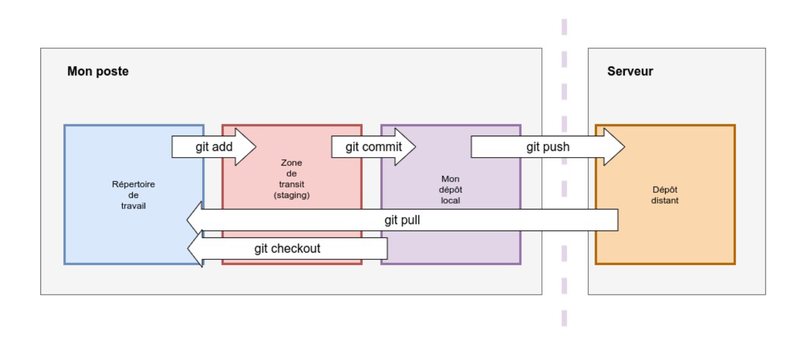</p> 

<br>

---

## **Côté client**

### **Installaion Git**

Pour ne pas m'emberter, je vais travailler sur un Debian10. \
Donc pour commencer il faut installer git (thx cpt obvious)

```terminal {title="bash"}
apt-get install git
```

La derniere version dispo avec les dépo de base dans Debian 10 et git ``2.20.1`` \
La toute derniere version de git est [2.32.0](https://git-scm.com/downloads) \
Un ``apt upgrade git`` ne suffit pas. 

Il y a peut-être un moyen plus simple de faire, mais voilà ce que j'ai fait : \
[source](https://devconnected.com/how-to-install-git-on-debian-10-buster/)


**required dependencies**

```terminal {title="bash"}
sudo apt-get install dh-autoreconf libcurl4-gnutls-dev libexpat1-dev gettext libz-dev libssl-dev
```

**documentation dependencies**

```terminal {title="bash"}
sudo apt-get install asciidoc xmlto docbook2x
```

**install-info dependencies**

```terminal {title="bash"}
sudo apt-get install install-info
```
**Download and build the latest Git version**

```terminal {title="bash"}
wget https://www.kernel.org/pub/software/scm/git/git-2.32.0.tar.gz
tar -zxf git-2.32.0.tar.gz
cd git-2.32.0
make configure
./configure --prefix=/usr
make all doc info
sudo make install install-doc install-html install-info
```
Maintenant il faut le configurer ([docs](https://www.git-scm.com/book/en/v2/Customizing-Git-Git-Configuration))

```terminal {title="bash"}
git config --global user.name "John Doe"
git config --global user.email johndoe@example.com
```

Voilà, git est en version ``2.32.0`` et configurer on peut commencer

<br>

---

### **Decouverte des commandes de base**

#### **Avec un dépôt local**

| | |
|---|---|
| Afficher l'aide											| ``git help`` |
| Initialisation d'un dépôt									| ``git init`` |
| Afficher l'état du dépôt local							| ``git status`` |
| Ajouter un fichier à l'index								| ``git add myfile.md`` |
| Annuler les modifications dans le répertoire de travail	| ``git restore myfile.md`` |
| Valider les modifications									| ``git commit -m “a comment”`` |
| Ignorer les modifications de certains fichiers			| ``echo ".DS_Store" > .gitignore`` |

<br>

#### **Exercice 1**

> Consigne: \
*Initialiser un dépôt Git "myproject", créer un fichier "test.txt" et l'ajouter à l'index. \
Supprimé le fichier "test.txt" de votre poste et récupéré le avec les commandes GIT.*

On commence par créer un dossier de travail
```terminal {title="bash"}
cd ~ && mkdir myproject && cd myproject
```

puis on l'initialise
```terminal {title="bash"}
git init
```

<p align="center">
  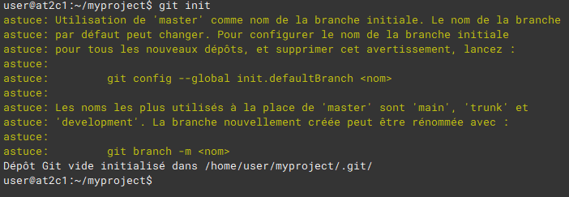
</p> 


on creer le fichier ``text.txt`` puis on l'index
```terminal {title="bash"}
echo “HelloWorld” > test.txt
git add test.txt
git commit -m "commit test.txt"
```

Maintenant on supprime le fichier ``test.txt`` pour pouvoir le restaurer avec git
```terminal {title="bash"}
rm test.txt
git restore test.txt
```
---

<br>

#### **Revenir en arrière**

| | |
|---|---|
| Afficher l'historique | ``git `log`` |
| Voir les différences | ``git diff [--cached]`` (--cached permet de voir les modifications indexées) |
| Voir les différences avec un commit | ``git diff [hash du commit]`` |
| Revenir à un commit (Attention, réécriture de l'historique GIT, à n'utiliser que sur ses branches) | ``git reset [hash du commit]`` |

<br>


---

#### **Exercice 2**

> Consigne : \
*Mettre du texte dans un fichier, l'indéxé et valider la modification. \
Supprimer du texte, et valider. \ 
Tenter de récupérer le texte avec les commandes GIT*

<br>

on commence pas rajouter du text dans le ``text2.txt``, puis on l'index et on commit les modifications

```terminal {title="bash"}
echo "this is a new line" >> test2.txt
git add test2.txt
git commit -m "ajout test2.txt"
```

on modifie maintenant le contenu du fichier puis on valide le changment 

```terminal {title="bash"}
sed -i "s/new line/modified line/g" test2.txt
git add test2.txt
git commit -m "change test2.txt"
```

on peut bien voir le changement avec ``git diff``

<p align="center">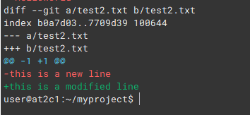</p> 

pour recuperer le contenu de base de ``test2.txt`` avant le changement, on fait un ``git log`` pour recuperer le hash du commit puis un ``git restore``. TO DO - CORRECTION

```terminal {title="bash"}
git log
git restore test2.tst
```

<p align="center">  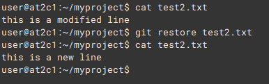</p> 

<br>

---

### **Decouverte des branchs**

Docs : https://git-scm.com/docs/git-branch \
Resource: https://www.atlassian.com/git/tutorials/using-branches

<br>

#### **Commandes Branch**

| | |
|---|---|
| Lister les branches (qui ont déjà des commits) |  ``git branch -a`` \ |
| Créer une branche et basculer dessus  |  ``git checkout -b “dev”`` \ |
| Basculer avec switch |  ``git switch master`` \ |
| Créer une branche avec switch |  ``git switch -c “mybranch”`` \ |
| Fusionner deux branches  |  ``git switch master \ git merge dev`` \ |
| Suppression d'une branche  |  ``git branch -d mybranch``\ |
| Remiser des modifications |  ``git stach`` \ |
| Sortir de la remise  |  ``git stash pop`` |

---

<br>

#### **Exercice 3**

> Consigne : \
*Valider des modifications sur une branche "dev" et les répercuter sur "master".*

<br>

on commence par verifier sur quel branch on est

<p align="center">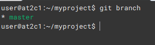</p> 

on créer et switch sur la nouvelle branch dev
```terminal {title="bash"}
git checkout -b “dev”
```

<p align="center">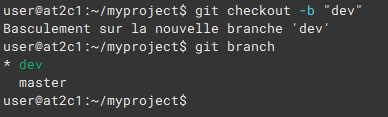</p> 

puis on modifie le test2.txt

```terminal {title="bash"}
echo "test modif dev branch" >> test2.txt
git add test2.txt
git commit -m "change test2.txt"
```
on peut bien voir que le contenu de test2.txt est different sur la branch dev est master

<p align="center">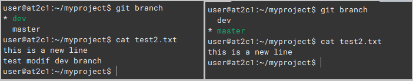</p> 

maintenant on merge ``dev`` à ``master``

```terminal {title="bash"}
git switch master
git merge dev
```

<p align="center">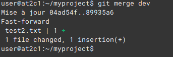</p> 

verification: 

<p align="center">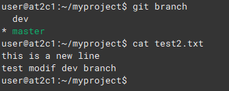</p> 

---

<br>

### **Avec un serveur**

#### **Commandes Server**

| | |
|---|---|
Récupérer un dépôt distant  |  ``git clone`` \ |
Mettre à jour le dépôt local à partir du dépôt distant (Tirer)  |  ``git pull`` \ |
Mettre à jour le dépôt distant à partir du dépôt local (Pousser)  |  ``git push`` \ |
Mettre uniquement les infos du dépôt à jour  |  ``git fetch`` \ |
Restaurer le dépôt tel qu'il l'était lors du commit spécifié (Attention : modification du répertoirecourant, potentiel perte detravail)  |  ``git revert [commit]`` |
 
<br>

---

#### **Gestion des conflits**

Lors d'un merge, si un fichier est modifié des deux côtés, une erreur s'affiche :

```terminal {title="bash"}
CONFLIT (ajout/ajout) : Conflit de fusion dans main.py
Fusion automatique de main.py
La fusion automatique a échoué ; réglez les conflits et validez le résultat.
```

La commande ``git status`` révèle le fichier en conflit :

```terminal {title="bash"}
Sur la branche dev
Vous avez des chemins non fusionnés.
	(réglez les conflits puis lancez "git commit")
	(utilisez "git merge --abort" pour annuler la fusion)
Chemins non fusionnés :
	(utilisez "git add <fichier>..." pour marquer comme résolu)
	ajouté de deux côtés :    main.py

aucune modification n'a été ajoutée à la validation (utilisez "git add" ou"git commit -a")
```

Le conflit apparait dans le fichier, cat main.py

```terminal {title="bash"}
<<<<<<< HEAD
test premiere ligne
=======
fix2 aussi sur 1ere ligne
>>>>>>> fixture2
```

Je garde le contenu de la branche courante marquée par "HEAD" (tête de la branche), ``cat`main.py`` :

```terminal {title="bash"}
test premiere ligne
```

ou, le contenu de la branche (``>>>>>>> [nom de la branche]``), ``cat main.py``  :

```terminal {title="bash"}
fix2 aussi sur la 1ere ligne
```

Une fois le conflit résolu (``suppression des <<, == et  >>``), je valide les modifications liées à la fusion :

```terminal {title="bash"}
git add main.py
git commit -m"merge fixture2 to dev"
```

Identifier les personnes qui ont modifié un fichier

```terminal {title="bash"}
git blame [fichier]
```

Pousser une branche locale sur le dépôt distant

```terminal {title="bash"}
git push --set-upstream origin mybranch
 ```

Supprimer une branche sur le dépôt distant

```terminal {title="bash"}
git push origin --delete mybranch
```

---

<br>

#### **Exercice 4**

> Consigne: \
> *Sur un dépôt commun, ajout du texte sur un même fichier (2 personnes par fichier) dans desbranches différentes  et fusionner les branches (voir dans quel cas il y a conflit et tenter de lesrésoudre)*

Pré-requis : Installer le client GIT \
Dépôt distant : ``http://212.47.231.145/AIS/collaborate.git``

<br>

**En HTTP :**

```terminal {title="bash"}
git clone http://212.47.231.145/AIS/collaborate.git
```
puis lors du clone on nous demandera les identifiants du server

<br>

**En SSH :**

```terminal {title="bash"}
git clone git@212.47.231.145:AIS/collaborate.git
```

Pour pouvoir s'y connecter, il faut renseigner sa clé ssh publique sur le serveur distant : ici gogs

j'en avais pas donc j'en genere une nouvelle

```terminal {title="bash"}
ssh-keygen -t rsa -b 4096
cat ~/.ssh/id_rsa.pub
```

<p align="center">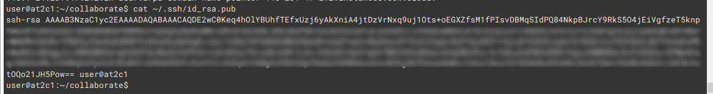</p> 

puis je la copie/colle dans dans les paramettre de mon compte gogs

<p align="center">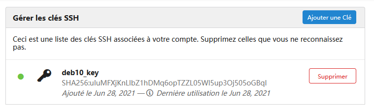</p> 


maintenant quand je me connect, je n'ai plus besoin de m'identifier

```terminal {title="bash"}
git clone git@212.47.231.145:AIS/collaborate.git
```

<p align="center">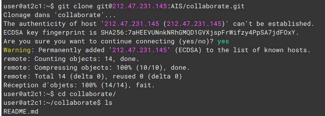
</p> 


TO DO - ADD SOME MOTRE COMMANDS OF WHAT I DID \
test de modfication, commit, merge push...

```terminal {title="bash"}
git clone git@212.47.231.145:AIS/collaborate.git

cd collaborate/

git switch develop

git branch

git checkout -b rremy/HelloWorld

git push --set-upstream origin rremy/HelloWorld

git branch

echo “I have no idea what I am doing” > Is_It_Working.txt

git add Is_It_Working.txt

git commit -m "create it_is_working.txt"

git push
```

```terminal {title="bash"}
git push origin --delete mabranche
git push --set-upstream origin mabranche
```

<br>

---

### **Test de different clients avec interface graphique**

[Tortoise Git](https://tortoisegit.org/) / [Sourcetree](https://www.sourcetreeapp.com/) / [Github Desktop](https://desktop.github.com/) / [GitKraken](https://www.gitkraken.com/) / [Git Cola](https://git-cola.github.io/) / Intégré à l'IDE comme VS Code / [Ungit](https://github.com/FredrikNoren/ungit)

Il y en a beaucoup donc je vais pas tout tester. \
Le vais essayer gitkraken et sourcetree

---

## **Côté serveur**

### **Les fournisseurs en ligne**

Présentation rapide de [Github](https://github.com/) / [Bitbucket](https://bitbucket.org/) / [Gitlab](https://gitlab.com/)


### **Installer son propre serveur Git**

#### **Git Server**
Installation d'un serveur Git en ligne de commande  \
https://git-scm.com/book/fr/v2/Git-sur-le-serveur-Mise-en-place-du-serveur

on créer un utilisateur ``git`` et un répertoire ``.ssh`` pour nos utilisateurs.

```terminal {title="bash"} 
sudo adduser git
su git
cd ~
mkdir .ssh && chmod 700 .ssh
touch .ssh/authorized_keys && chmod 600 .ssh/authorized_keys
```

il faut ajouter la clé publique des utilisateur autorisée a se connecter a ``authorized_key``

```terminal {title="bash"}
sudo cat /home/user/.ssh/id_rsa.pub
ssh-rsa AAAAB3NzaC1yc2EAAAADAQABAAACAQDE2wC0Keq4hOlYBUhfTEfxUzj6yAkXniA4jtDzVrNxq9uj1Ots
[...]
[...]
[...]
[...]
+fGd8iRde3rr6F9cYctOQo21JH5Pow== user@at2c1
```

```terminal {title="bash"}
sudo cat /home/user/.ssh/id_rsa.pub >> /home/git/.ssh/authorized_keys
```

```terminal {title="bash"}
mkdir /opt/git/firstrepo && cd /opt/git/firstrepo
mkdir project.git && cd project.git
git init --bare
```

Maintenant les utilisateur authorisées peuvent simplement faire un 
```terminal {title="bash"}
git clone git@SERVER_IP:/opt/git/firstrepo/project.git
cd project
```

Voilà, le server est OP \
Bon forcement il me dit que j'ai cloner un repo vide car il est vraiment vide, pour l'instant je n'ai creer aucun dossier ou fichier.

<p align="center">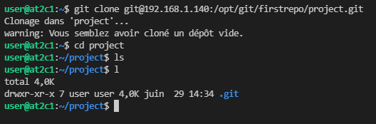</p> 

<br>

---

#### **Gogs**
Déploiement d'un serveur avec une interface Web \
https://gogs.io/docs/installation \
https://gogs.io/docs/installation/install_from_source

```terminal {title="bash"}
sudo adduser --disabled-login --gecos 'Gogs' git
```

**Installation de Go**


```terminal {title="bash"}
sudo su - git
cd ~
# Créer un dossier pour installer 'go'
mkdir local
# Télécharger Go (changer go$VERSION.$OS-$ARCH.tar.gz par la dernière version)
# wget https://storage.googleapis.com/golang/go$VERSION.$OS-$ARCH.tar.gz
wget https://golang.org/dl/go1.16.5.linux-amd64.tar.gz
# expand it to ~/local
tar -C /home/git/local -xzf go1.16.5.linux-amd64.tar.gz
```

**Configurer l’environnement**

```terminal {title="bash"}
sudo su - git
cd ~
echo 'export GOROOT=$HOME/local/go' >> $HOME/.bashrc
echo 'export GOPATH=$HOME/go' >> $HOME/.bashrc
echo 'export PATH=$PATH:$GOROOT/bin:$GOPATH/bin' >> $HOME/.bashrc
source $HOME/.bashrc
```

**Installer Gogs**

```terminal {title="bash"}
# Télécharger et installer les dépendances
$ go get -u github.com/gogs/gogs

# Compiler le programme principal
$ cd $GOPATH/src/github.com/gogs/gogs
$ go build
```
ERROR HERE

TO DO - FINISH - 

<br>

---

#### **Gitea**
Déploiement d'un serveur avec une interface Web \
https://gitea.io/en-us/ \
https://docs.gitea.io/en-us/install-from-source/ \
https://jeremyverda.net/installing-gitea-on-debian/ \
https://computingforgeeks.com/install-gitea-git-service-on-debian-10-buster/

Il n'y a pas forcement besoin de faire tout ça, mais c'est hyper rapid et ça fonctionne.

Add a user and Install MariaDB database server

```terminal {title="bash"}
sudo adduser git
su git
cd ~
sudo apt -y install mariadb-server
sudo mysql_secure_installation 
```

Configure the database
```terminal {title="bash"}
sudo mysql -u root -p
```

```mysql
CREATE DATABASE gitea;
GRANT ALL PRIVILEGES ON gitea.* TO 'gitea'@'localhost' IDENTIFIED BY "password";
FLUSH PRIVILEGES;
QUIT;
```

Install Gitea on Debian 10

```terminal {title="bash"}
export VER=1.9.4
wget https://github.com/go-gitea/gitea/releases/download/v${VER}/gitea-${VER}-linux-amd64
```
```terminal {title="bash"}
chmod +x gitea-${VER}-linux-amd64
sudo mv gitea-${VER}-linux-amd64 /usr/local/bin/gitea
```

```terminal {title="bash"}
$ gitea --version
Gitea version 1.9.4 built with GNU Make 4.1, go1.12.10 : bindata, sqlite, sqlite_unlock_notify
```

Configure Systemd

```terminal {title="bash"}
sudo mkdir -p /etc/gitea /var/lib/gitea/{custom,data,indexers,public,log}
sudo chown git:git /var/lib/gitea/{data,indexers,log}
sudo chmod 750 /var/lib/gitea/{data,indexers,log}
sudo chown root:git /etc/gitea
sudo chmod 770 /etc/gitea
```

Create a systemd service file for Gitea.

```terminal {title="bash"}
sudo vim /etc/systemd/system/gitea.service
```

```bash
[Unit]
Description=Gitea (Git with a cup of tea)
After=syslog.target
After=network.target
After=mysql.service

[Service]
LimitMEMLOCK=infinity
LimitNOFILE=65535
RestartSec=2s
Type=simple
User=git
Group=git
WorkingDirectory=/var/lib/gitea/
ExecStart=/usr/local/bin/gitea web -c /etc/gitea/app.ini
Restart=always
Environment=USER=git HOME=/home/git GITEA_WORK_DIR=/var/lib/gitea

[Install]
WantedBy=multi-user.target
```

```terminal {title="bash"}
sudo systemctl daemon-reload
sudo systemctl enable --now gitea
```

Configure Nginx proxy

```terminal {title="bash"}
sudo apt -y install nginx
sudo vim /etc/nginx/conf.d/gitea.conf
```

```terminal {title="bash"}
server {
    listen 80;
    server_name git.example.com;

    location / {
        proxy_pass http://localhost:3000;
    }
}
```

```terminal {title="bash"}
sudo systemctl restart nginx
```
Finish Gitea Installation from Web interface

go to ``http://IP_ADDRESS:3000/install``


Paramètres de la base de données et general

a part le mot de passe, tout est déjà rempli, vu que c'est jutse pour un test cela me va très bien.

puis clic sur Install gitea

lors de la toute premiere utilisation, il faut se creer un compte (on aurais pu le faire lors de la configuration)

Voilà, gitea est up & running


<p align="center">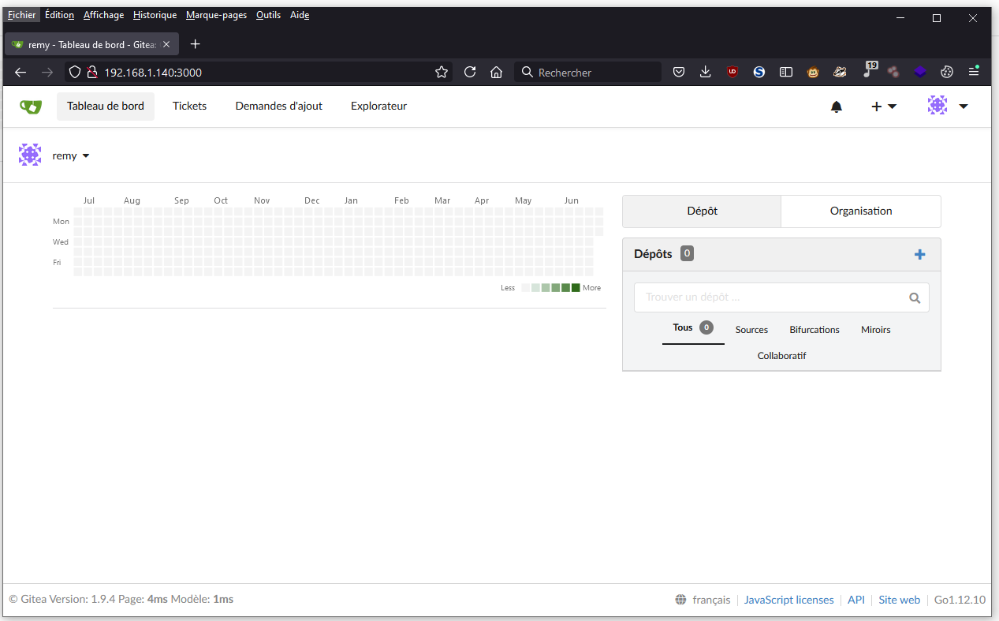</p> 

---

#### **Gitlab**
Resource : https://about.gitlab.com/install/#debian

TO DO

---

## **Usage avancé**

### **Workflow**

**Pull request** : https://www.atlassian.com/fr/git/tutorials/making-a-pull-request

**Gitflow** : https://jeffkreeftmeijer.com/git-flow/

**Github flow** : https://guides.github.com/introduction/flow/

**Revue de code:** \
Gerrit > https://www.gerritcodereview.com/ \
Review Board / Open Source / https://www.reviewboard.org/ \
Crucible d'Atlassian : https://www.atlassian.com/software/crucible

**Intégration continue**
GitOps \
Clé de déploiement \
Webhook \
Jenkins - https://www.jenkins.io/ \
Drone IO - https://www.drone.io/ \
Github Action \
Gitlab Pipeline

### **Les commandes avancées**
git tag \
rebasage \
avance rapide \
amend \
cherry pick

### **Cheatseet**

Cheatsheet GIT - https://www.atlassian.com/fr/git/tutorials/atlassian-git-cheatsheet


<br>

---

# **Docker**

sem du 30/06/2021 au 02/07/2021

[Support de cours - Les conteneurs](Docker-les-conteneurs.pdf) \
[Support de cours - Les Services](Docker-les-services.pdf) \
[Support de cours - Les CLuster](Docker-les-clusters.pdf)

<br>

## **Les Conteneurs**


### **Présentation du contexte général et historique**

#### **Docker, qu‘est-ce que c‘est ?**

- Docker permet de créer des environnements (appelés containeurs) de manière à isoler desapplications.
- Techniquement, Docker étend le format de conteneur Linux standard, LXC, avec une API dehaut niveau fournissant une solution pratique de virtualisation qui exécute les processus defaçon isolée. Docker est donc avant tout une solution pratique pour manipuler desconteneurs LXC
- L'idée est de lancer du code (ou d'exécuter une tâche,) dans un environnement isolé. La technologie est en partie proposée en open source (sous licence Apache 2.0) par unesociété américaine (dotCloud), désormais appelée Docker, qui a été lancée par un Français : **Solomon Hykes**.

**Qu‘est-ce qu‘un conteneur ?**

- Virtualisation d‘Os
- Perception d‘environnement isolé et indépendant
- Package déclaratif
- Unité de déploiement "universelle"
- Idéal pour le développement et les tests

**En comparaison à une VM**

- La virtualisation traditionnelle permet, via un hyperviseur, de simuler une ou plusieursmachines physiques, et les exécuter sous forme de machines virtuelles (VM) sur un serveurou un terminal. Ces VM intègrent elles-mêmes un OS sur lequel les applications qu'ellescontiennent sont exécutées. Ce n'est pas le cas du container. Le container fait directementappel à l'OS de sa machine hôte pour réaliser ses appels système et exécuter ses applications.
- Les containers Docker au format Linux exploitent un composant du noyau Linux baptisé LXC(ou Linux Container).  Le moteur Docker normalise ces briques par le biais d'API dansl'optique d'exécuter les applications dans des containers standards, qui sont ensuiteportables d'un serveur à l'autre.

<p align="center">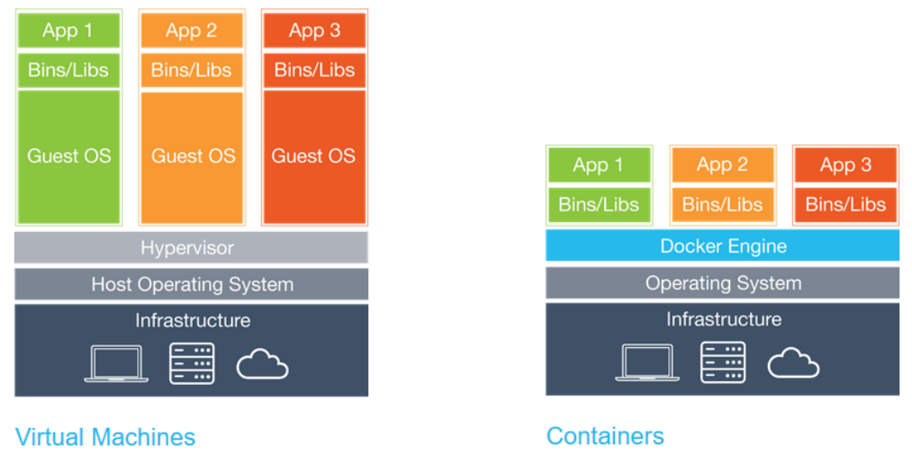</p> 


**Avantages du conteneur**
- Comme le container n'embarque pas d'OS, à la différence de la machine virtuelle, il est parconséquent beaucoup plus léger que cette dernière. Il n'a pas besoin d'activer un secondsystème pour exécuter ses applications.Cela se traduit par un lancement beaucoup plus rapide, mais aussi par la capacité à migrerplus facilement un container (du fait de son faible poids) d'une machine physique à l'autre.
- Les containers Docker, du fait de leur légèreté, sont portables de cloud en cloud. Seulecondition : que les clouds en présence soient optimisés pour les accueillir. Et c'est désormaisle cas des principaux d'entre eux.
Un conteneur Docker, avec ses applications, peut donc passer aisément d'un cloud à unautre.
- Déploiements rapides.
Du fait de la disparition de l'OS intermédiaire et des VM, les développeurs bénéficient aussid'une pile applicative plus proche de celle de l'environnement de production, ce quiengendre mécaniquement moins de mauvaises surprises lors des passages en production.

**Objectif**

Docker permet d'embarquer une application dans un container virtuel qui pourra s'exécuter surn'importe quel machine. \
Chaque micro-service joue un rôle très précis, ne fait qu'une chose et interagit avec les autres, quiensemble fournissent un service complexe. \
C'est une technologie qui a pour but de faciliter les déploiements d'application, et la gestion dudimensionnement de l'infrastructure sous-jacente.

**Son nom**
- Docker tire son nom des containers du monde du transport, dont la taille standardisée apermis de rationaliser les moyens d‘acheminement et d‘abaisse rles coûts du transport.
- Un conteneur = une unité de transport intermodal.
- Cette philosophie a été transposée au monde informatique.
- Un container = une unité de traitement logique qui exécute une tâche donnée.

**L'aboutissement**
- Virtualisation des processus :
- UNIX chroot               (1979 – 1982)
- BSD Jail                       (1998)
- Parallels Virtuozzo    (2001)
- Solaris Containers    (2005)
- Linux LXC                   (2008)
- Docker                        (2013)
- cgroups, qui va avoir pour objectif de gérer les ressources (utilisation de la RAM, CPU entreautres). / Layer FS / Namespaces / Kernel
- Docker découle de toutes ces technologies !Docker répond aux besoins d‘échelonnage (scalabilité) des grandes multinationnales telleque Netflix, AirBnB ...
- Le besoin originel consistait à pouvoir valider les tests de bon fonctionnement d‘un point A àun point B, et aussi à cloisonner les fonctionnalités en conteneurs distincts.

**Architecture**

Le moteur Docker (Docker Engine) est éxécuté sur un serveur Linux. \
Le client Docker, disponible sous Mac, Linux et Windows, interagit avec les moteurs grâce à l'API REST. \
Le Docker Hub est le référentiel public d'images. C'est un "Docker Registry" qui permet de stockerles images construites à partir de fichier Dockerfile

<center></center>

<p align="center">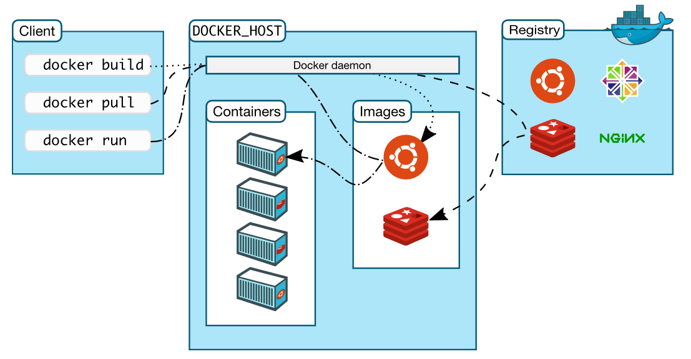</p> 

Cf: https://docs.docker.com/get-started/overview/

---

<br>

### **Installation de Docker**

https://docs.docker.com/engine/install/debian/

Set up the repository
```terminal {title="bash"}
sudo apt-get update
sudo apt-get install apt-transport-https ca-certificates curl gnupg lsb-release
```

Add Docker’s official GPG key:
```terminal {title="bash"}
curl -fsSL https://download.docker.com/linux/debian/gpg | sudo gpg --dearmor -o /usr/share/keyrings/docker-archive-keyring.gpg
```

```terminal {title="bash"}
echo \
  "deb [arch=amd64 signed-by=/usr/share/keyrings/docker-archive-keyring.gpg] https://download.docker.com/linux/debian \
  $(lsb_release -cs) stable" | sudo tee /etc/apt/sources.list.d/docker.list > /dev/null
```

Install Docker Engine
```terminal {title="bash"}
sudo apt-get update
sudo apt-get install docker-ce docker-ce-cli containerd.io
```

<br>

Test install OK :

```terminal {title="bash"}
docker run hello-world
```
```terminal {title="bash"}
docker run docker/whalesay cowsay "C'est trop bien Docker"
```

<p align="center">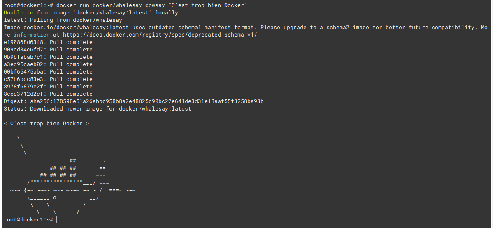</p> 

<br>

En quoi consiste le démarrage du container ?
1) Recherche de l’image. \
⇒ Si l’image n’existe pas en local, alors téléchargement via le hub. Construction du système defichiers au sens Linux.
2) Démarrage du container
3) Configuration de l’adresse IP du container. \
⇒ Ainsi que de la communication entre l’extérieur et le container.
4) Capture des messages d’ entrées-sorties

**Important** \
Philosophiquement, on n’exécute qu’un seul processus à la fois. \
un container = une application (ou processus) \
pas d’exécution de démons, de services, ssh, etc. \
même le processus init n’existe pas !

---

<br>

### **Les images**

Les images Docker sont d'une importance cruciale :
- Une image est un container statique. On pourrait comparer une image à une capture d'uncontainer à un moment donné, d'une sorte de snapshot d'un de vos containers.
- Lorsqu'on souhaite travailler avec un container, on déclare forcément un container à partird'une image.
- De plus, les images Docker fonctionnent grâce à l'héritage d'autres images. Une image deTomcat héritera elle-même de l'image de Java. Cette même image de Java qui a peut-être étéconstruite à partir d'une Debian.
Les héritages peuvent ainsi aller très loin ! Le container créé à partir d'une image contient ledelta entre l'image de base à partir de laquelle le container a été instancié et l'état actuel. C’est grâce à ce système que la duplication de données est faible et que docker est léger !


Une image peut avoir été construite à partir d'une autre image qui elle-même a pu êtreconstruite à partir d'une autre image. Ce système fonctionne parfaitement grâce à un systèmed'empilement de containers. \
 Par conséquent, lorsque vous construisez une image à partir d'une autre image vous stockez enréalité tous les containers qui vous ont permis de passer de votre image de base à votre imagefinale. Vous pouvez le visualiser en exécutant la commande :
```terminal {title="bash"}
 docker history
```
 Vous pouvez à tout moment voir votre bibliothèque d'images avec la commande :
```terminal {title="bash"}
 docker image ls
 ```
 Comment récupérer (pull) une image Docker ? \
 Il existe une plateforme maintenue par Docker sur laquelle tout le monde peut pusher et pullerdes images. \
 Cette bibliothèque géante partagée, c'est le Docker Hub Registry :
 
 https://hub.docker.com/ 
 

---

### **Manipulation des containers**

**Documentation officielle** : https://docs.docker.com

**Aide**
```terminal {title="bash"}
docker --help
docker create --help
```
Antisèche : https://github.com/wsargent/docker-cheat-sheet \
Play with Docker : https://www.docker.com/play-with-docker

**Lancement**

```terminal {title="bash"}
docker run nom_image      # Télécharger (le cas échéant) une image et lancerle container.
docker run -it nom_image  # (entre en mode interactif dans l'image)
docker start <id>         # lancer un conteneur existant
docker stop <id>          # stopper le conteneur <id>
docker pull nom_image     # Télécharger une image SANS lancer le container.  
docker exec -it [id_container] bash # Entrer dans un container actif
docker attach [container]   # Pour se rattacher au TTY en cours (et non unnouveau)
docker images               # liste des images locales
docker ps-a                 # voir les processus.
docker info                 # informations générales (!!!)
```


<p align="center">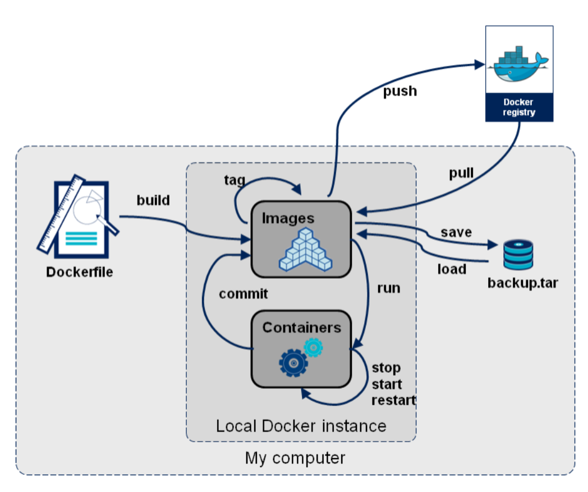</p> 

<br>

---

##### **Exercice 1**

> Consigne: \
*Démarrer un conteneur Ubuntu sur l'invite de commande.*


```bash
docker run -it ubuntu bash 
```

<p align="center">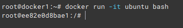</p> 

<br>

---

#### **Suppression**

<p align="center">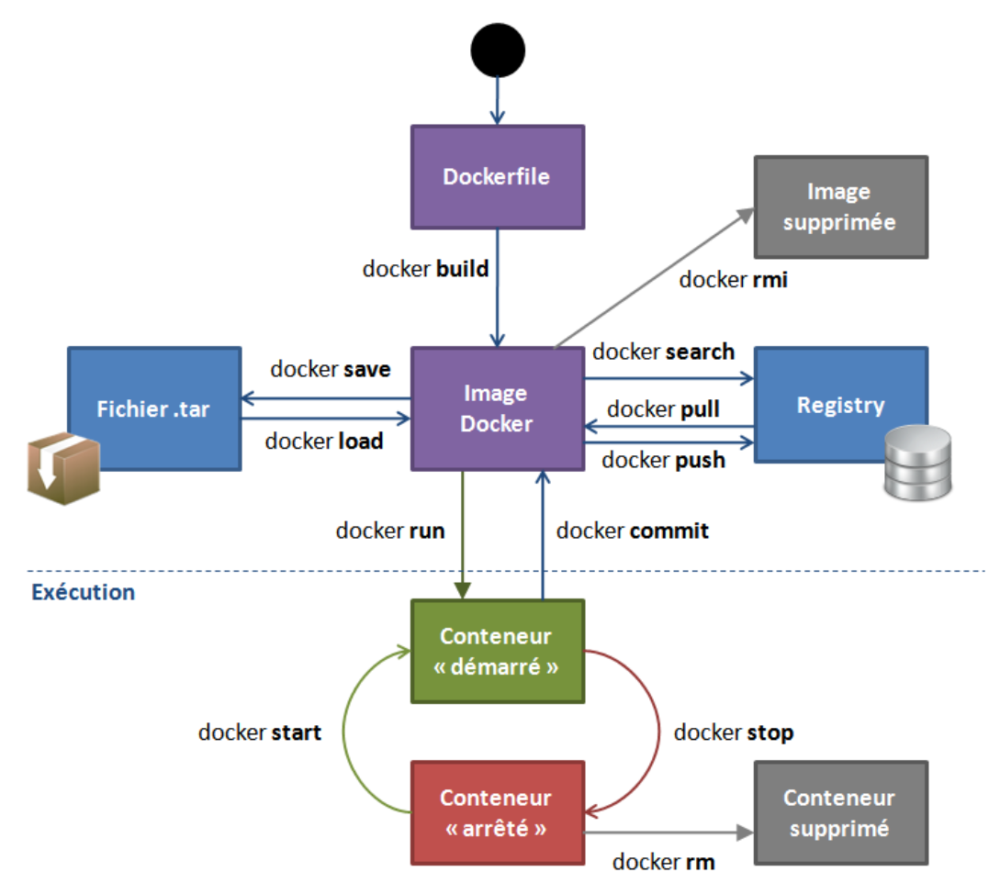</p> 

Supprimer un conteneur ou supprimer tous les conteneurs :

```terminal {title="bash"}
docker container rm id_du_conteneur
docker container rm $(docker container ps -a -q) # Utile en alias dans.bashrc !
```
Supprimer une image:

```terminal {title="bash"}
docker image rm id_ou_nom_de_l_image
```
ou :
```terminal {title="bash"}
docker rmi id_ou_nom_de_l_image
```

<br>

#### **Informations**

Inspecter la configuration d'un container :
```terminal {title="bash"}
docker inspect (Attention, sortie verbeuse, à affiner !!)
```
Voir les logs d'un conteneur :
```terminal {title="bash"}
docker logs &lt;container_name&gt; -f
```

<br>

#### **Nettoyage**

Faire le ménage :
```terminal {title="bash"}
docker system prune
docker volume prune
docker network prune
docker container prune
docker image prune
```

Supprime tout ce qui n'est pas utilisé (à utiliser avec précaution !)

#### **Astuces**

Trouver l'adresse IP d'un conteneur :
```terminal {title="bash"}
docker inspect --format'{{ .NetworkSettings.IPAddress }}' CONTAINER_ID
```
Créez-vous des alias, exemples :
```terminal {title="bash"}
alias drm="docker rm"
alias dps="docker ps"
alias dl='docker ps -l -q'
```

Une sortie de ps plus lisible :
```terminal {title="bash"}
docker ps-a | less -S
```

<br>

### **Options à connaître**

**Docker content Trust**

```terminal {title="bash"}
export DOCKER_CONTENT_TRUST=1
```

Après ceci, si vous tentez de 'puller' une image non signée, Docker vous mettra en garde.

Pour tester :

```terminal {title="bash"}
docker pull docker/trusttest:latest²
```
L'option ``--disable-content-trust`` vous permettra au besoin d'outre-passer la vérification ;)

<br>

**Limiter les ressources**

Pour limiter l'espace mémoire d'un conteneur à 1Go RAM, lancez-le avec l'option :
```terminal {title="bash"}
--memory="100M"
```

Vous pouvez aussi limiter le nombre de coeurs CPUs accessibles à un conteneur avec l'option :
```terminal {title="bash"}
--cpu=X
```
Où X est le nombre de CPUs que vous mettez à disposition de votre conteneur.

<br>

**Accès distant**

Dans ``/lib/systemd/system/docker.service``, modifier la ligne ExecStart par :
```terminal {title="bash"}
ExecStart=/usr/bin/dockerd -H fd:// -H tcp://0.0.0.0:2375
```

Puis :
```terminal {title="bash"}
systemctl daemon-reload
systemctl restart dockerd
```

Côté client

```terminal {title="bash"}
docker -H IP_du_serveur:2375 ps-a
```

Pour éviter de mettre l'option -H systématiquement, en direct OU dans le .bashrc de chaque
utilisateur :

```terminal {title="bash"}
exportDOCKER_HOST=IP_du_serveur:2375

```

<br>

### **Les volumes**

**Création d'un volume**

```terminal {title="bash"}
docker volume create mon_volume
```

Le volume est ensuite dans ``/var/lib/docker/volumes/mon_volume``.

Pour visualiser les volumes :

```terminal {title="bash"}
docker volume ls
```

Détail d'un volume :
```terminal {title="bash"}
docker volume inspect mon_volume
```

Supprimer un volume (garde fou si utilisé) :
```terminal {title="bash"}
docker volume rm mon_volume
```

Lancer un conteneur avec ce volume:
```terminal {title="bash"}
docker run -it -v mon_volume:/levolume debian:stable
```

---

<br>

#### **Exercice 2**

> Consigne : \
*Créer un conteneur avec une base de données MariaDB persistante (données toujours présentes
après l'arrêt et la suppression du conteneur).*

Astuce :
```terminal {title="bash"}
# pour se connecter à une base de données MariaDB
mysql -u root -p

# pour créer une base de données
CREATE DATABASE testdbpersist;

SHOW DATABASES;
```

```terminal {title="bash"}
docker volume create vol_mariadb
docker volume ls
```

<p align="center">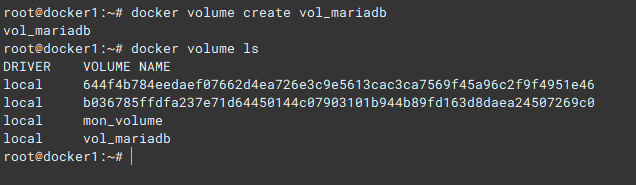
</p> 


```terminal {title="bash"}
docker run -dit  --name testmariadb -v vol_mariadb:/var/lib/mysql -e MYSQL_ROOT_PASSWORD=root mariadb:latest
docker exec -it testmariadb bash

mysql -u root -p
CREATE DATABASE testdbpersist;
SHOW DATABASES;
```

<p align="center">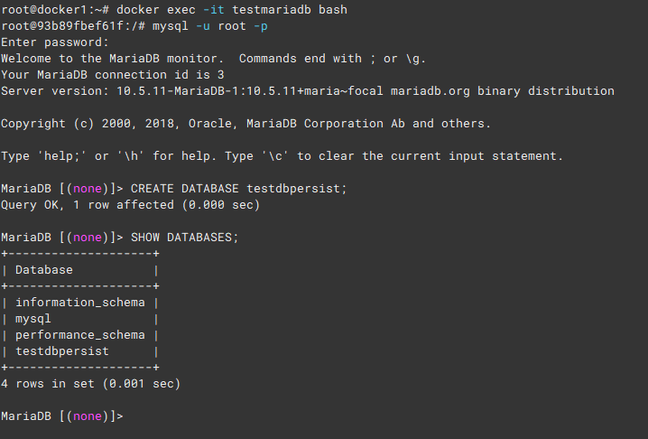</p> 

```terminal {title="bash"}
docker stop testmariadb
docker start testmariadb
docker exec -it testmariadb bash

mysql -u root -p
SHOW DATABASES;
```

<p align="center">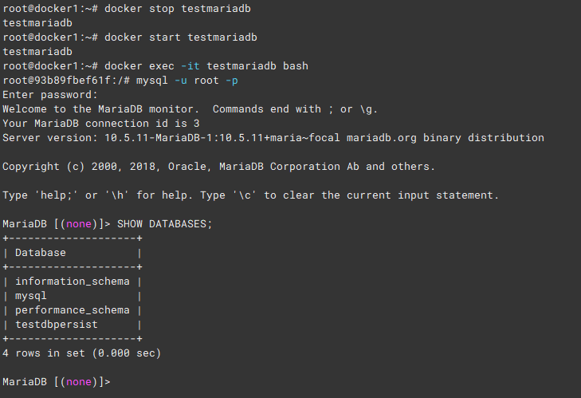</p> 

on voit bien que la DB est persistant au redemarage du conteneur


```terminal {title="bash"}
docker stop testmariadb
docker rm testmariadb
```

vu que la base est persistante, ``-e MYSQL_ROOT_PASSWORD=root`` n'est plus nessecaire
```terminal {title="bash"}
docker run -dit --name test2mariadb -v vol_mariadb:/var/lib/mysql  mariadb:latest

docker exec -it test2mariadb bash

mysql -u root -p
SHOW DATABASES;
```

<p align="center">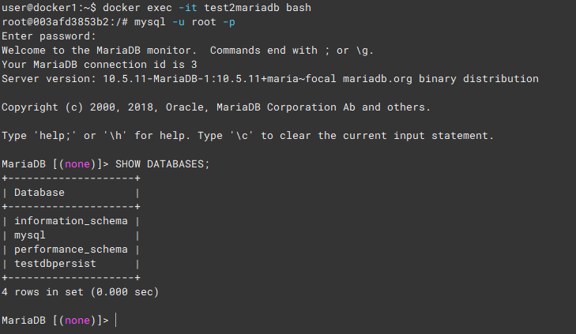</p> 

et là on voit bien qu'ell est persistante entre differentes images

<br>


---

#### **Montage d'un répertoire local**

C'est un montage dit "bind mount".

Il s'agit de monter un répertoire du filesystem de l'hôte sur le container, afin qu'ils interagissent,
et que les données de travail soient persistantes malgré la nature volatile du container.

Exemple :

```terminal {title="bash"}
docker run -dit--name devtest -p8080:80 --mount type=bind,source="$(pwd)"/www,target=/usr/local/apache2/htdocs/ httpd:2.4
```

OU :

```terminal {title="bash"}
docker run -dit--name devtest -p8080:80 -v "$(pwd)"/www:/usr/local/apache2/htdocs/: httpd:2.4
```

<br>

#### **Montage d'un répertoire distant**

**En SSH**

Accéder à un Filesystem distant via SSHFS grâce à un driver :

```terminal {title="bash"}
docker plugin install --grant-all-permissions vieux/sshfs
docker volume create --driver vieux/sshfs \
-osshcmd=usrvol@nodessh:/home/usrvol \
-opassword=mdp monvolumessh

docker run -d \
--name sshfs-container \
--mounttype=volume,volume-driver=vieux/sshfs,src=monvolumessh,target=/app,volume-opt=sshcmd=usrvol@nodessh:/home/usrvol,volume-opt=password=mdp \ 
busybox ls /app
```

Test de montage avec busybox :

```terminal {title="bash"}
docker run -it-v monvolumessh:/vol busybox ls /vol
```

**En NFS**

Exemple de montage avec le protocole nfs (paquet nfs-common nécessaire) :

```terminal {title="bash"}
docker volume create --driver local \
    --opttype=nfs \
    --opto=addr=nodessh,rw \
    --optdevice=:/shared \
    volnfs
```

Exemple Docker-compose :

```terminal {title="bash"}
version: '3.2'
volumes:
    monsupervolumenfs:
        driver_opts:
            type: "nfs"
            o: "addr=192.168.99.102,nolock,soft,rw"
            device: ":/shared"
            
services:
    monter:
        image: php:7-apache
        volumes:
            - type: volume
            source: monsupervolumenfs
            target: /var/www/html
            read_only: true
            volume:
            nocopy: true
```

<br>

--- 

### **Le réseau**

``--link`` déprécié

Les commandes ``network`` :

```terminal {title="bash"}
docker network create my-net
docker network connect my-net my-nginx
docker network disconnect my-net my-nginx
docker network inspect my-net
docker network ls
docker network rm my-net
```

Créer un conteneur en l'attachant à un réseau :

```terminal {title="bash"}
docker run --name my-nginx \
    --network my-net \
    --publish8080:80 \
    nginx:stable
```

<br>

---

#### **Exercice 3**

> Consigne: \
*Adminer est une interface d'administration de base de données.* \

*A l'aide de l'image adminer et en créant un réseau, déployez une interface Web pour gérer les
bases de données de deux conteneurs MariaDB (à déployer également).*


<sup><sup>thx jean</sup></sup>

creation du network
```terminal {title="bash"}
docker network create ais-network
```

creation du premier conteneur mariadb
```terminal {title="bash"}
docker run -dit --name db1 --network ais-network -e MARIADB_ROOT_PASSWORD=password mariadb
```

connexion au conteneur mariadb pour créer une bdd
```terminal {title="bash"}
docker exec -ti db1 bash
mysql -u root -p
create database proot;
show databases;
```

creation du deuxieme contenur mariadb
```terminal {title="bash"}
docker run -dit --name db2 --network ais-network -e MARIADB_ROOT_PASSWORD=password2 mariadb
```

connexion au conteneur mariadb pour créer une bdd
```terminal {title="bash"}
docker exec -ti db2 bash
mysql -u root -p
create database proot;
show databases;
```

creation du troisieme contenur adminer

```terminal {title="bash"}
docker run --link some_database:db --name adminer --network ais-network -p 8080:8080 adminer
```

<br>

---

<br>

### **Les sauvegardes**

Crée une image à partir d'un container existant
```terminal {title="bash"}
docker commit mon_conteneur mon_image
```

Sauvegarder une image dans une archive :
```terminal {title="bash"}
docker save -o mon_container.tar mon_container
```

Exporter un conteneur au format tar.gz (ne sauvargarde pas les volumes attachés) :
```terminal {title="bash"}
docker export mon_conteneur > mon_container.tgz
```

Importer un conteneur au format tar.gz :
```terminal {title="bash"}
cat mon_container.tgz | docker import - mon_image
```

Autre exemple : sauvegardez vos conteneurs avec une commande telle que celle-ci :
```terminal {title="bash"}
docker run --rm-v /tmp:/backup --volumes-from <container-name> busybox tar -cvf /backup/backup.tar <path-to-data>
```

Puis restaurez avec :
```terminal {title="bash"}
docker run --rm-v /tmp:/backup --volumes-from <container-name> busybox tar -xvf /backup/backup.tar <path-to-data>
```

<br>

---

### **Politique de redémarrage**

Pour créer un container qui redémarre automatiquement ou quand le service
docker redémarre :

```terminal {title="bash"}
docker run -dit--restart [options] [container]
```

options :
- ``no`` = Ne pas redémarrer automatiquement le container, c'est l'option par
défaut quand on fait un docker run -it [container]
- ``on-failure(:nombre redémarrage)`` = redémarre le container s'il c'est arrêter à cause
d'une erreur, \
si le code d'erreur est un code de sortie. \
Si vous mettez ``on-failure:3`` au bout de trois redémarrages, il s'arrêtera.
- ``unless-stopped`` = redémarre le container s'il c'est arrêter ou si docker lui-même s'est
stoppé ou a redémarré.
- ``always`` = Le container va toujours redémarrer peut importe ce qui l'a stoppé.


La politique de redémarrage ne s'exécute que si le container a démarré avec succès.
Il ne redémarrera jamais en boucle.

Si vous stoppez manuellement un container, la politique de redémarrage est ignorée, à part si le
daemon docker est redémarré ou si on redémarre manuellement le container.
Elle s'applique uniquement aux containers.

https://docs.docker.com/config/containers/start-containers-automatically/


Pour ajouter un politique de redémarrage à un container déjà existant :

```terminal {title="bash"}
docker update --restart [options] [container]
```

<br>

---

### **Création d'un Dockerfile**

Important, le nom du fichier est ``Dockerfile`` (il faut donc organiser par répertoire).

**Un premier Dockerfile**

```terminal {title="bash"}
FROM httpd:2.4
COPY ./index.html /usr/local/apache2/htdocs/
```

Lancer la construction:

```terminal {title="bash"}
docker build -t my-apache2 .
```

Puis lancer un container avec l'image générée :

```terminal {title="bash"}
docker run -dit--disable-content-trust--name apache-server -p8080:80 my-apache2
```

**un Dockerfile HAProxy**
```terminal {title="bash"}
FROM alpine:3.8
RUN apk update \
    apk add haproxy
    
ADD haproxy.cfg /etc/haproxy/
ENTRYPOINT ["haproxy", "-db", "-f", "/etc/haproxy/haproxy.cfg"]
```

<br>

#### **Les instructions**

Documentation officielle : https://docs.docker.com/engine/reference/builder/

| | |
|---|---|
| **``FROM``** 			| définit l’image sur laquelle on va s’appuyer pour créer notre image. Cette image peut êtreune image officielle ou bien une de vos images. Cette instruction est toujours la première dufichier Dockerfile. \ |
| **``#``**				| Ceci est un commentaire. Abusez-en !!!! \ |
| **``MAINTAINER``**	| indique la personne qui a créé ou maintient ce Dockerfile. \ |
| **``RUN``**			| exécute une commande sur l’image courante. Chaque instruction RUN va créer unenouvelle image temporaire qui sera utilisée dans le cas d’une modification ultérieure de votreDockerfile. Cela permet d’accélérer le temps de construction de nouvelles images. \ |
| **``CMD``**			| Cette clé est unique et si il y en a plusieurs seule la dernière sera utilisé. CMD définit lacommande a exécuter lors du lancement d’un conteneur. Cette option peut être surchargée parla commande docker run. \  |
| **``ENV``**			| permet d’affecter une valeur à une variable d’environnement. \ |
| **``ADD``**			| permet de copier de nouveaux fichiers, dossiers locaux ou des fichiers distant pour les ajouter dans le système de fichier du conteneur selon le chemin indiqué. On peut utiliser desarchives qui si le format est reconnu sera décompressé à la volée. Utile pour copier des sourcesd’applications. \ |
| **``COPY``**			| copie des fichiers, des dossiers et les ajoute dans le système de fichier indiqué.Contrairement à ADD impossible d’ajouter une URL ou de demander la décompression d’une archive. \ |
| **``ENTRYPOINT``**	| Indique la commande par défaut qui sera lancée au démarrage du conteneur.Comme pour CMD cette clé est unique et si il y en a plusieurs, seul le dernier sera pris encompte. Contrairement à CMD, ENTRYPOINT ne peut pas être surchargé par la commande“docker run”. Les arguments passés lors de la commande “docker run” seront utilisés enarguments à la commande spécifiée dans l’instruction ENTRYPOINT. \ |
| **``VOLUME``**		| ajoute un/des filesytem(s) aux conteneurs à partir de dossier locaux. Ces volumespeuvent être partagés et réutilisés dans différents conteneurs. On peut les utiliser par exemplepour que les conteneurs puissent accéder à du code source, une base de données etc ... \ |
| **``USER``**			| ésigne quel utilisateur lancera les prochaines instructions RUN ou ENTRYPOINT. Trèsutile pour éviter d’avoir à utiliser l’utilisateur root constamment. \ |
| **``WORKDIR``** 		| définit le répertoire de travail qui sera utilisé pour le lancement des commandes ENTRYPOINT et/ou CMD. \ |
| **``ONBUILD``**		| cette instruction ajoute des triggers aux images. Un trigger est exécuté lorsquel’image est utilisée pour construire une autre image. Le déclencheur lance une instruction lors dela construction de la nouvelle image comme si elle avait été spécifié juste après le FROM. \ |
| **``EXPOSE``**		| indique quelle sont le ou les port(s) qui pourront communiquer avec l’extérieur. |

<br>

**Example de Dockerfile**

<br>

pour que ce soit plus propre, je fait un repertoire juste pour cette image/dockerfile

```terminal {title="bash"}
mkdir firstimg && cd firstimg
```

```terminal {title="bash"}
vi index.html
```
```html
<!DOCTYPE html>
<html>
    <head>
        <title>Mon premier Dockerfile</title>
    </head>
    <body>
    HelloWorld!! This is a Dockerfile test
    </body>
</html>
```

```terminal {title="bash"}
vi Dockerfile
```

```terminal {title="bash"}
FROM httpd:2.4
COPY ./index.html /usr/local/apache2/htdocs/
```

```terminal {title="bash"}
docker build -t my-httpd-test .
docker run -dit --disable-content-trust --name apache-server -p8080:80 my-httpd-test
```

<p align="center"></p> 


<br>

---

#### **Exercice 4**

> Consigne : \
*En partant de l’image alpine, créez un Dockerfile appelant ping et prenant en paramètre du
conteneur le host à pinger (localhost par défaut)*

```terminal {title="bash"}
mkdir exo5 && cd exo5
```

```terminal {title="bash"}
vi Dockerfile
```

```terminal {title="bash"}
FROM alpine:latest

RUN apk update && apk add bash
ENTRYPOINT ["ping", "-c", "4"]
CMD ["localhost"]
```

```terminal {title="bash"}
docker build -t exo-alpine .
```

maintenant quand on run notre image, par defaut elle ping ``localhost``
```terminal {title="bash"}
docker run -it exo-alpine
```

<p align="center">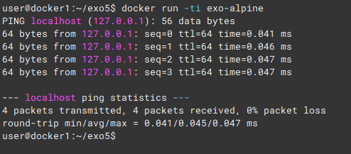</p> 
 
Si on rajoute une adresse a la fin, ça ping l'adresse en question
```terminal {title="bash"}
docker run -it exo-alpine 9.9.9.9
```

<p align="center">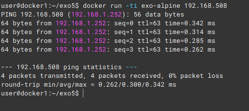</p> 

<br>

---


#### **Exercice 5**

> Consigne: \
*En partant de l'image officielle Debian (Stretch), écrivez un fichier Dockerfile permettant de
démarrer un serveur Web avec un répertoire local des pages Web.* 


```terminal {title="bash"}
mkdir exo6 && cd exo6
```

creation d'un fichier custom apache2.conf
```terminal {title="bash"}
vi apache2.conf
```

```bash
DefaultRuntimeDir ${APACHE_RUN_DIR}
PidFile ${APACHE_PID_FILE}
Timeout 300
KeepAlive On
MaxKeepAliveRequests 100
KeepAliveTimeout 5
User ${APACHE_RUN_USER}
Group ${APACHE_RUN_GROUP}
HostnameLookups Off
ErrorLog ${APACHE_LOG_DIR}/error.log
LogLevel warn
IncludeOptional mods-enabled/*.load
IncludeOptional mods-enabled/*.conf
Include ports.conf

<Directory />
        Options FollowSymLinks
        AllowOverride None
        Require all denied
</Directory>

<Directory /var/www/>
        Options Indexes FollowSymLinks
        AllowOverride None
        Require all granted
</Directory>

AccessFileName .htaccess
<FilesMatch "^\.ht">
        Require all denied
</FilesMatch>

IncludeOptional conf-enabled/*.conf

IncludeOptional sites-enabled/*.conf
```

```terminal {title="bash"}
vi Dockerfile
```

```yml
FROM debian:latest

ENV DEBIAN_FRONTEND noninteractive

RUN apt update && apt -y upgrade
RUN apt install -y apache2

COPY apache2.conf /etc/apache2/
COPY ./index.html /var/www/html/
WORKDIR /var/www/html

EXPOSE 80
CMD service apache2 start
```

```terminal {title="bash"}
docker build -t exo-debian .
docker run -dit --disable-content-trust --name apache-server -p8080:80 exo-debian
```


<br>

---
---
 
<br>

## **Les Services**

### **Découverte de docker-compose**

Docker Compose est un utilitaire fournit par Docker pour simplifier le déploiement d'application multi-conteneurs. \
À partir d'un fichier déclaratif YAML ``docker-compose.yml``, il déploie un service composé de plusieurs containeurs. \
Le nom du répertoire détermine le nom du service. \
Les conteneurs sont désormais gérés par la commande ``docker-compose``.

Documentation officielle : https://docs.docker.com/compose/

<br>

### **Installation de docker-compose**

Doc : https://docs.docker.com/compose/install/

```terminal {title="bash"}
sudo curl -L "https://github.com/docker/compose/releases/download/1.29.2/docker-compose-$(uname -s)-$(uname -m)" -o /usr/local/bin/docker-compose

sudo chmod +x /usr/local/bin/docker-compose
```

Pour vérifier l'installation :
```terminal {title="bash"}
docker-compose version
```

<p align="center">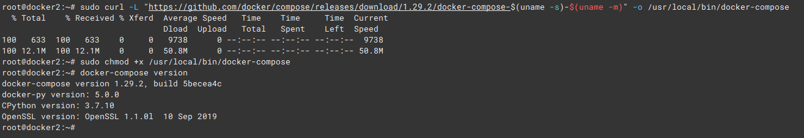</p> 

<br>

**Création de fichiers docker-compose.yml**

```yml
version: '3.7'
services:
  gitea:
    image: gitea/gitea:latest
    environment:
      - DB_TYPE=postgres
      - DB_HOST=db:5432
      - DB_NAME=gitea
      - DB_USER=gitea
      - DB_PASSWD=gitea
    restart: always
    volumes:
      - git_data:/data
    ports:
      - 3000:3000
  db:
    image: postgres:alpine
    environment:
      - POSTGRES_USER=gitea
      - POSTGRES_PASSWORD=gitea
      - POSTGRES_DB=gitea
    restart: always
    volumes:
      - db_data:/var/lib/postgresql/data
    expose:
      - 5432
volumes:
  db_data:
  git_data:
```

pour le lancer

```terminal {title="bash"}
docker-compose up -d
```
et pour l'arreter
```terminal {title="bash"}
docker-compose down
```

<br>

Références du compose file : https://docs.docker.com/compose/compose-file/compose-file-v3/

Gisement d'exemples: https://docs.docker.com/compose/samples-for-compose/

<br>

---

### **Exercice 6**

> Consigne: \
*Créer un ``docker-compose.yml`` pour l'exercice avec "Adminer" : \
A l'aide de l'image adminer et en créant un réseau, déployez une interface Web pour gérer les bases de données de deux conteneurs ``MariaDB`` (à déployer également).*

<br>

```terminal {title="bash"}
cd ~ && mkdir compose_exo1 && cd compose_exo1
```


``docker-compose.yml``

```yml
version: '3.8'
services:
  mariadb1:
    image: mysql:latest
    environment:
      MYSQL_ROOT_PASSWORD: rootpassword
      MYSQL_DATABASE: db_test
    ports:
      - 6666:3306
    volumes:
      - mariadb_vol:/var/lib/mysql
    restart: always
  
  mariadb2:
    image: mysql:latest
    environment:
      MYSQL_ROOT_PASSWORD: rootpassword
      MYSQL_DATABASE: db_test2
    ports:
      - 6665:3306
    volumes:
      - mariadb_vol:/var/lib/mysql
    restart: always
    
  adminer_cont:
    container_name: adminer
    image: adminer:latest
    environment:
      ADMINER_DEFAULT_SERVER: mariadb1
    ports:
      - 8888:8080
    restart: always

volumes:
  mariadb_vol:
```


---

**Déploiement de services**

**Les commandes**


```bash
# builder et démarrer les conteneurs en mode détaché
docker-compose up -d
# --no-recreate ou --force-recreate / --build force le build

# démarrer les conteneurs
docker-compose start

# arrêter les conteneurs
docker-compose stop

# supprimer les conteneurs
docker-compose rm

# supprimer les conteneurs du service et les volumes
docker-compose down -v

# afficher les processus
docker-compose ps

# contrôler la syntaxe du fichier docker-compose.yml
docker-compose config

# afficher les logs
docker-compose logs -f

# augmenter le nombre de réplicats d'un service
docker-compose up -d --scale monservice= 2
```

Référence des commandes : https://docs.docker.com/compose/reference/

<br>

---

### **Exercice 7**

> Consigne : \
*A l'aide de docker-compose déployez un ensemble de conteneurs avec une base de données MariaDB, une interface d'administration pour cette base de données (PhpMyAdmin) et un serveur Web avec PHP. \
Il faudra vérifier que PhpMyAdmin parviens bien à joindre la base de données et que le fichier ``index.php`` suivant peut être exécuté sur le serveur WEB :*

<br>

```terminal {title="bash"}
cd ~ && mkdir compose_exo2 && cd compose_exo2

vi index.php
```
```php
<?php
phpinfo();
?>
```

``docker-compose.yml``
```yml
version: '3.8'

services:
  mysqldb:
    image: mysql:latest
    restart: always
    container_name: db
    environment:
      MYSQL_ROOT_PASSWORD: rootpassword
      MYSQL_DATABASE: db_exo2
    ports:
      - "6033:3306"
    volumes:
      - exo2_vol:/var/lib/mysql
      
  phpmyadmin:
    image: phpmyadmin:latest
    restart: always
    container_name: pma
    links:
      - mysqldb
    environment:
      PMA_HOST: mysqldb
      PMA_PORT: 3306
      PMA_ARBITRARY: 1
    ports:
      - 8081:80
      
  php:
    image: php:7.4-apache
    ports:
      - '8000:80'
    links:
      - mysqldb
      
  server:
    image: nginx
    restart: always
    ports:
      - '80:80'
    links:
      - php
    volumes:
      - exo2_vol:/usr/share/nginx/www/
  
volumes:
  exo2_vol:
```

``Dockerfile``
```bash
WORKDIR /usr/share/nginx/www/
COPY index.php index.php
```
<br>

---

### **Exercice 8**

> Consigne :
*Déployez le code ``app.py`` dans un containeur. \
Cette application gère son cache avec ``Redis.`` \
Astuce : installez les dépendances ``Python`` avec la commande ``pip install -r requirements.txt``*

<br>

```terminal {title="bash"}
cd ~ && mkdir compose_exo3 && cd compose_exo3
```
<sup><sup><sup>free beers for Jean</sup></sup></sup>

``app.py``

```python
import time
import socket
import redis
from flask import Flask

app = Flask(__name__)
cache = redis.Redis(host='redis', port=6379)

def get_hit_count():
    retries = 5
    while True:
        try:
            return cache.incr('hits')
        except redis.exceptions.ConnectionError as exc:
            if retries == 0:
                raise exc
            retries -= 1
            time.sleep(0.5)

@app.route('/')
def hello():
    count = get_hit_count()
    name = socket.gethostname()
    ip = socket.gethostbyname(name)
    return f"Hello World! I have been seen {count} times. \n Generated by container {name} ({ip})"

if __name__ == "__main__":
    app.run(host="0.0.0.0", debug=True)
```

``requirement.txt``

```
flask
redis
```

``Dockerfile``
```bash
FROM python:3

WORKDIR /tmp
COPY app.py .
COPY requirement.txt .

RUN pip install -r requirement.txt
CMD [ "app.py" ]
ENTRYPOINT ["python3"]
```

``docker-compose.yml``
```yml
version: '3.8'
services:
  redis:
    image: redis:latest
    hostname: redis
    ports:
      - "6379:6379"
  python:
    build: .
    ports:
      - "7000-7777:5000"
```

```terminal {title="bash"}
docker-compose up --scale python=5 -d
```

<p align="center">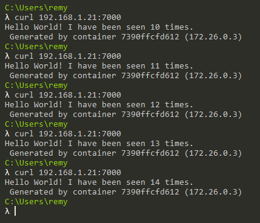</p> 

<br>

---
---

## **Les Cluster**

### **Les orchestrateurs**

Permet de :

+ provisionner et placer les conteneurs
+ monitorer
+ gestion du failover
+ dimenssionnement
+ gestion des mises à jour et rollbacks des conteneurs
+ découverte de service et gestion du réseau

**Kubernetes**

Développé par Google \
Adopter aux déploiements d'envergure \
Fonctionnalités très avancées (autoscaling, load balancing.. ) \
Prise en main difficile

**Swarm**

Natif / facile à mettre en oeuvre \
Fonctionnalités limités mais souvent suffisante

**Ochestrateurs packagées**

Les cloud providers proposent désormais des orchestrateurs "As A Service". (Scaleway, ECS, AKS, GCE)

<br>

### **Installer Docker machine**

<p align="center">  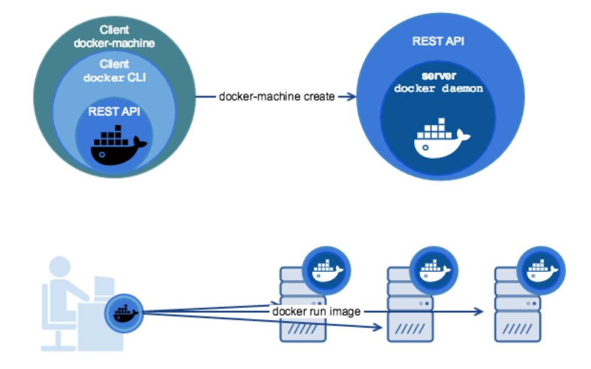</p> 

Doc: https://docs.docker.com/machine/ \
Installation par binaire : https://docs.docker.com/machine/install-machine/

Sur Linux :

```terminal {title="bash"}
base=https://github.com/docker/machine/releases/download/v0.16.0 \
  && curl -L $base/docker-machine-$(uname -s)-$(uname -m) >/tmp/docker-machine \
  && sudo mv /tmp/docker-machine /usr/local/bin/docker-machine \
  && chmod +x /usr/local/bin/docker-machine
```

Tester l'installation :

```terminal {title="bash"}
docker-machine version
```

Lister les machines

```terminal {title="bash"}
docker-machine ls
```

Créer une machine avec Virtualbox

```terminal {title="bash"}
docker-machine create --driver virtualbox mondocker
```

Je suis principalement sur VMWare donc il me faut les driver VMware \
https://github.com/machine-drivers/docker-machine-driver-vmware \
https://github.com/pecigonzalo/docker-machine-vmwareworkstation \
https://www.digitalocean.com/community/tutorials/how-to-install-go-on-debian-10


Affichage des variables d'environnement de connexion à la machine :

```terminal {title="bash"}
docker-machine env mondocker
```

Basculer sur la machine :

```terminal {title="bash"}
eval $(docker-machine env mondocker1)
docker ps
```

Machine actuellement manipulé

```terminal {title="bash"}
docker-machine active
```

IP de la machine

```terminal {title="bash"}
docker-machine ip mondocker
```

Prendre la main en ssh

```terminal {title="bash"}
docker-machine ssh mondocker
```

Autres commandes :

```terminal {title="bash"}
docker-machine start mondocker
docker-machine stop mondocker
docker-machine status mondocker
```
	
<br>

### **Mise en place d'un cluster Swarm**

https://docs.docker.com/engine/swarm/

```bash
# initialisation du cluster
docker swarm init --listen-addr [ip leader1] --advertise-addr [ip leader1]

# rejoindre le cluster
docker swarm join-token -q worker
# sur le noeud à lier
docker swarm join --token $token [ip leader1]:

# affiche les infos de notre docker engine dont les infos du cluster swarm
docker info

# sur le leader, affiche la liste des noeuds
docker node ls

# affiche la liste des réseaux
docker network ls

# Modifier la disponibilité d'un noeud
docker node update --availability drain leader

# forcer la redistribution
docker service update --force [service name]

# Aide sur la commande de gestion des services
docker service help

# dimenssionner manuellement un service
docker service scale [service name]= 3
```

<br>

### **Déploiement de services sur le cluster**

```bash
# déploiement d'une stack
docker stack deploy mastack --compose-file docker-compose.yml

# affichage des stacks déployées
docker stack ls

# affichage des services d'une stack
docker stack services mastack

# affichage des tâches pour une stack
docker stack ps mastack
```

Nouveautés pour le ``docker-compose.yml``, à mettre pour chaque service :

```yml
deploy:
  replicas: 5
  restart_policy:
    condition: on-failure
  resources:
    limits:
      cpus: "0.1"
      memory: 50M
```

https://docs.docker.com/compose/compose-file/compose-file-v3/#deploy

Pour déployer une stack avec des services dont les images sont à builder, il faut que celle-ci soit disponible depuis tous les noeuds

<br>

---

#### **Exercice 9**

> Consigne: \
*Déployer la stack avec Adminer et mariadb sur le cluster. \
Vérifier que les conteneurs communiques bien, même si ils ne sont pas sur le même noeud.*


```terminal {title="bash"}
cd ~ && mkdir cluster_exo1 && cd cluster_exo1
```

``docker-compose.yml``
```yml
version: '3.8'
deploy:
  replicas: 5
  restart_policy:
    condition: on-failure
  resources:
    limits:
      cpus: "0.1"
      memory: 50M
services:
  mariadb1:
    image: mysql:latest
    environment:
      MYSQL_ROOT_PASSWORD: rootpassword
      MYSQL_DATABASE: db_test
    ports:
      - 6666:3306
    volumes:
      - mariadb_vol:/var/lib/mysql
    restart: always
  
  mariadb2:
    image: mysql:latest
    environment:
      MYSQL_ROOT_PASSWORD: rootpassword
      MYSQL_DATABASE: db_test2
    ports:
      - 6665:3306
    volumes:
      - mariadb_vol:/var/lib/mysql
    restart: always
    
  adminer_cont:
    container_name: adminer
    image: adminer:latest
    environment:
      ADMINER_DEFAULT_SERVER: mariadb1
    ports:
      - 8888:8080
    restart: always

volumes:
  mariadb_vol:
```

```terminal {title="bash"}
docker stack deploy mastack --compose-file docker-compose.yml
docker stack services mastack
```

<p align="center">  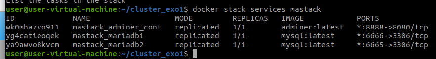</p> 

on peut voir que adminer est disponible depuis 3 ip differentes (les 3 replicas)

<p align="center">  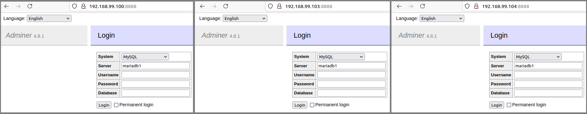</p> 


<br>

---

### **Le registre privé**

Lancer le service

```yml
version: '3.8'

services:
  myregistry:
    image: registry:2
    ports:
      - 5000:5000
```

Autoriser les "insecure" registries dans ``/etc/docker/daemon.json`` et redémarrer les démons
Docker:

```json
{
    "insecure-registries":["192.168.56.121:5000"]
}
```

Build and push :

```terminal {title="bash"}
docker build -t myregistry.
docker tag myregistry 192 .168.56.121:5000/myregistry
docker push 192 .168.56.121:5000/myregistry
```

Lister les images disponibles :

```terminal {title="bash"}
curl http://192.168.56.121:5000/v2/_catalog
```
<br>

---

#### **Exercice 10**

> Consigne : \
*Créer un registry privé et pousser l'image avec l'API Python dessus, puis déployer la stack avec cette image et le redis.*

creation du fichier ``docker-compose`` puis : 

```terminal {title="bash"}
docker stack deploy myregistry --compose-file docker-compose.yml
```
<p align="center">  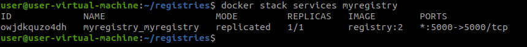</p> 

pour l'instant c'est vide mais c'est normal

<p align="center">  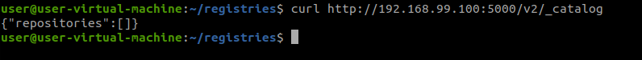</p> 

pour pousser une image sur ce registre: \
Je vais en premier dans le repertoire de l'image pour la build avec un tag

<br>

---

**Les interfaces graphiques**

**Portainer.io**

<p align="center">  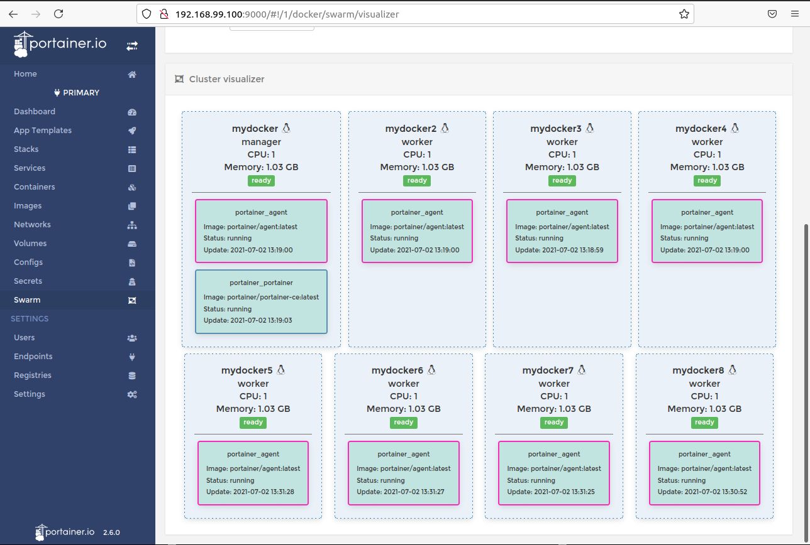</p> 


https://documentation.portainer.io/

Installation sur Docker Swarm

```terminal {title="bash"}
curl -L https://downloads.portainer.io/portainer-agent-stack.yml -o portainer-agent-stack.yml

docker stack deploy -c portainer-agent-stack.yml portainer
```
<p align="center">  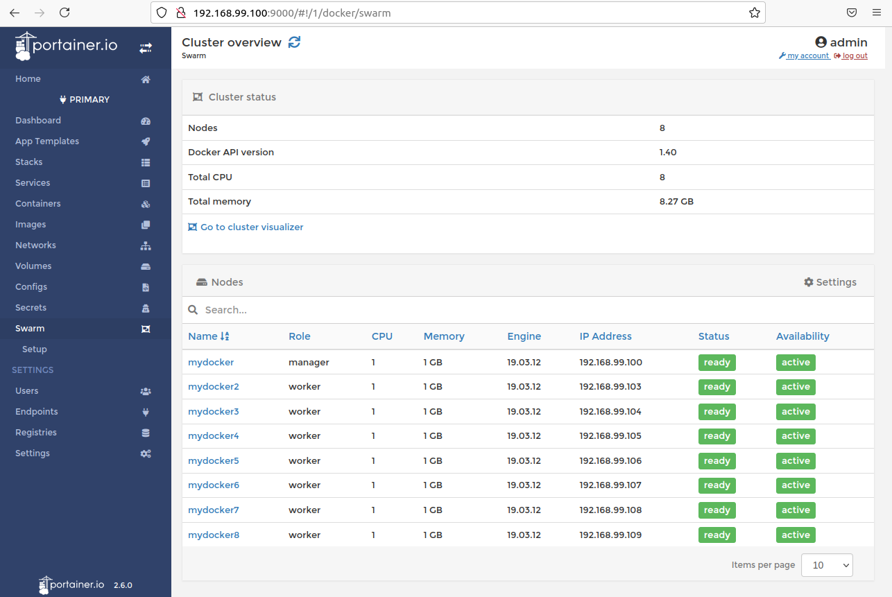</p>

<br>

**Swarmpit**

<p align="center">  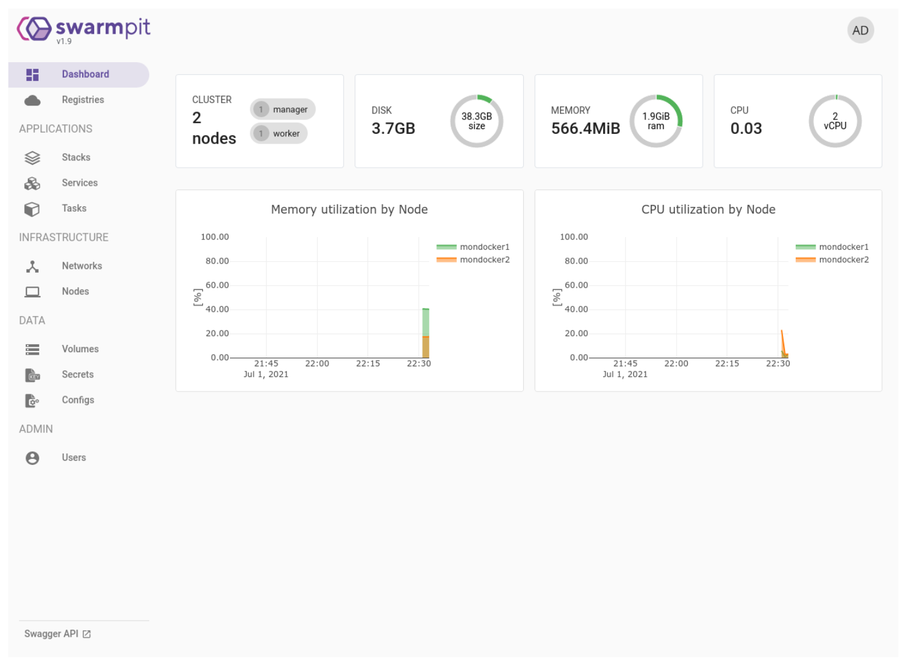</p> 

https://swarmpit.io/

```terminal {title="bash"}
docker run -it --rm \
--name swarmpit-installer \
--volume /var/run/docker.sock:/var/run/docker.sock \
swarmpit/install:1.
```

<br>

---

#### **Exercice 11**

> Consigne : \
*Déployer une interface graphique sur son cluster swarm. \
Visualiser le positionnement des containeurs et leurs usages des ressources.*

<br>

---

**Les contraintes de placement**

Ajouter des étiquettes aux noeuds :

```terminal {title="bash"}
docker node update --label-add job=worker docker
```

Ajouter les containtes dans le ``docker-compose`` :

```yml
version: '3.4'

services:
  apitest:
    image: 192.168.56.121:5000/api_test
    environment:
      HOTE: "{{ .Service.Name }} : {{.Node.Hostname}} -> {{.Task.Name}}"
    ports:
      - 5000:5000
    deploy:
      replicas: 3
      placement:
        constraints: [node.labels.job == worker]
```

<br>

---

#### **Exercice 12**

> Consigne : \
*Ajouter un label de votre choix à un seul noeud et forcer un service à se déployer dessus. \
En mettre un deuxième avec ce même label et arrêter l'autre noeud. \
Redémarrer ensuite le noeud et forcer la redistribution.*

<br>

---

### **Traefik**

https://doc.traefik.io/traefik/getting-started/quick-start/

<p align="center">  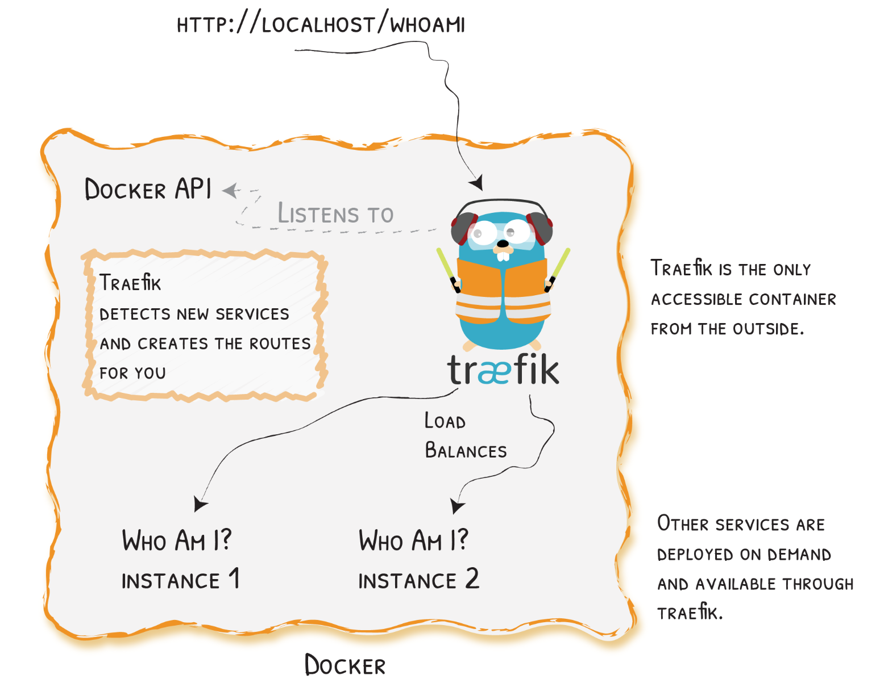</p> 


```yml
version: '3'

services:
  reverse-proxy:
    # The official v2 Traefik docker image
    image: traefik:v2.
    # Enables the web UI and tells Traefik to listen to docker
    command: --api.insecure=true --providers.docker
    ports:
    # The HTTP port
      - "80:80"
      # The Web UI (enabled by --api.insecure=true)
      - "8080:8080"
    volumes:
      # So that Traefik can listen to the Docker events
      - /var/run/docker.sock:/var/run/docker.sock
  whoami:
  # A container that exposes an API to show its IP address
  image: traefik/whoami
  labels:
    - "traefik.http.routers.whoami.rule=Host(`whoami.docker.localhost`)"
```

--- 


# Ansible

Sem : 26/07/2021 - 30/07/2021
With Sebastien REUILLER

## Ansible Resources
- https://www.ansible.com/
- [Ansible Documentation](https://docs.ansible.com/ansible/latest/index.html)
- [NetworkChuck Video enplaining Ansible](https://www.youtube.com/watch?v=5hycyr-8EKs )
- https://openclassrooms.com/fr/courses/2035796-utilisez-ansible-pour-automatiser-vos-taches-de-configuration/6371043-identifiez-ce-que-vous-pouvez-automatiser

bookmark
- https://yamlchecker.com/
- https://docs.ansible.com/ansible/latest/user_guide/vault.html
- https://www.ansible.com/ansiblefest
- https://campus.cefim.eu/pluginfile.php/55034/mod_resource/content/3/ansible.pdf
- https://docs.google.com/spreadsheets/d/1ZWgpJm5dtvCECo6kOYABjivzovfAgOyGwe3-l8PX88E/edit#gid=0
- https://docs.ansible.com/ansible/latest/user_guide/index.html
- https://docs.ansible.com/ansible/2.3/authorized_key_module.html
- https://github.com/Ginkgo-Balboa/post-install
- https://askubuntu.com/questions/46424/how-do-i-add-ssh-keys-to-authorized-keys-file
- https://docs.ansible.com/ansible/latest/scenario_guides/guide_vagrant.html#introduction
- https://www.vagrantup.com/docs/provisioning/ansible
- https://linuxtricks.fr/wiki/debian-installer-virtualbox
- https://hunter2.gitbook.io/darthsidious/building-a-lab/building-a-lab-with-esxi-and-vagrant
- https://docs.ansible.com/ansible/latest/user_guide/playbooks_variables.html#playbooks-variables
- https://docs.ansible.com/ansible/latest/user_guide/playbooks_vars_facts.html
- https://labs.qandidate.com/blog/2013/11/21/installing-a-lamp-server-with-ansible-playbooks-and-roles/
- https://openclassrooms.com/fr/courses/2035796-utilisez-ansible-pour-automatiser-vos-taches-de-configuration/6373897-assemblez-les-operations-avec-les-playbooks-pour-automatiser-le-deploiement
- https://www.theurbanpenguin.com/installing-mariadb-using-ansible/
- https://docs.fuga.cloud/how-to-install-wordpress-using-ansible
- https://dotlayer.com/how-to-use-an-ansible-playbook-to-install-wordpress/?PageSpeed=noscript
- https://github.com/tucsonlabs/ansible-playbook-wordpress-nginx
- https://docs.ansible.com/ansible/latest/user_guide/playbooks_handlers.html
- https://docs.ansible.com/ansible/2.9/modules/apt_repository_module.html
- https://docs.ansible.com/ansible/latest/collections/ansible/builtin/template_module.html#ansible-collections-ansible-builtin-template-module
- https://www.digitalocean.com/community/tutorials/how-to-use-ansible-to-install-and-set-up-wordpress-with-lamp-on-ubuntu-18-04-fr
- https://galaxy.ansible.com/search?deprecated=false&tags=system&keywords=&order_by=-relevance
- https://docs.ansible.com/ansible/latest/user_guide/playbooks_tags.html
- https://docs.ansible.com/ansible/latest/galaxy/user_guide.html#the-command-line-tool
- https://www.vagrantup.com/docs/provisioning/ansible
- https://docs.fuga.cloud/how-to-install-wordpress-using-ansible
- https://docs.ansible.com/ansible/latest/user_guide/playbooks_checkmode.html
- https://galaxy.ansible.com/docs/contributing/creating_role.html
- https://hectormartinez.dev/posts/ansible-03-multiple-machines-multiple-playbooks/
- https://github.com/crivetimihai/ansible_virtualization
-  https://galaxy.ansible.com/docs/developers/contributing.html#build-the-environment
- https://github.com/tlovett1/wordpress-ansible-playbook
- https://github.com/geerlingguy/ansible-role-mysql
- https://github.com/A5hleyRich/wordpress-ansible
- https://github.com/geerlingguy/ansible-examples/tree/master/wordpress-nginx
- https://docs.ansible.com/ansible/latest/user_guide/playbooks_reuse_roles.html?highlight=roles&extIdCarryOver=true&sc_cid=701f2000001OH7YAAW
- https://docs.ansible.com/ansible/latest/user_guide/index.html#working-with-inventory
- https://linuxhint.com/using_ansible_galaxy/
- https://docs.ansible.com/ansible/latest/user_guide/intro_inventory.html
- https://github.com/ansible/ansible-examples/tree/master/lamp_haproxy
- https://www.educba.com/ansible-inventory_hostname/
- https://www.digitalocean.com/community/tutorials/how-to-set-up-ansible-inventories
- https://docs.ansible.com/ansible/latest/network/getting_started/first_inventory.html
- https://docs.fuga.cloud/how-to-install-wordpress-using-ansible
- https://github.com/nerrad/wordpress-ansible-playbook
- https://mariadb.com/kb/en/configuring-mariadb-for-remote-client-access/
- https://docs.ansible.com/ansible/2.3/haproxy_module.html


--- 

### Docker Secret

on en aura besoin pour Traefik donc on monte le cluster swarm maintenant.

on est tous sur la même ip public, donc est est limité au nombre de pull qu'on peut faire. il faut donc se connecter au docker hub.

probleme, mon mot de pass est un password fort avec caractere spéciiaux, donc il faut en premier creer un fiche pass.txt puis utiliser se fichier comme mot de passe
https://docs.docker.com/engine/reference/commandline/login/
```terminal {title="bash"}
root@deb10remy3:~# cat pass  | docker login --username wemr --password-stdin
WARNING! Your password will be stored unencrypted in /root/.docker/config.json.
Configure a credential helper to remove this warning. See
https://docs.docker.com/engine/reference/commandline/login/#credentials-store

Login Succeeded
root@deb10remy3:~# 
```

Creation d'un secret 
```terminal {title="bash"}
root@deb10remy3:~# printf "This is a secret" | docker secret create my_secret_data -
x391vm93ejma6nyjaa7c2rft6
root@deb10remy3:~# docker secret inspect my_secret_data
[
    {
        "ID": "x391vm93ejma6nyjaa7c2rft6",
        "Version": {
            "Index": 55
        },
        "CreatedAt": "2021-07-26T11:38:05.219685026Z",
        "UpdatedAt": "2021-07-26T11:38:05.219685026Z",
        "Spec": {
            "Name": "my_secret_data",
            "Labels": {}
        }
    }
]
root@deb10remy3:~#
```

### Treafik

---

https://doc.traefik.io/traefik/getting-started/quick-start/


```terminal {title="bash"}
mkdir traefik && cd traefik
```

### Traefik

https://doc.traefik.io/traefik/getting-started/quick-start/


`docker-compose.yml` :

```bash
version: '3'

services:
  reverse-proxy:
    # The official v2 Traefik docker image
    image: traefik:v2.4
    # Enables the web UI and tells Traefik to listen to docker
    command: --api.insecure=true --providers.docker
    ports:
      # The HTTP port
      - "80:80"
      # The Web UI (enabled by --api.insecure=true)
      - "8080:8080"
    volumes:
      # So that Traefik can listen to the Docker events
      - /var/run/docker.sock:/var/run/docker.sock
  whoami:
    # A container that exposes an API to show its IP address
    image: traefik/whoami
    labels:
      - "traefik.http.routers.whoami.rule=Host(`whoami.docker.localhost`)"
```

https://dev.to/ohffs/traefik-v2-with-docker-swarm-2cgh


En mode Docker Swarm  :
https://dockerswarm.rocks/traefik/

```terminal {title="bash"}
docker network create --driver=overlay proxy

docker pull traefik:v2.4 
```

`traefik.yml`

```yaml
version: "3.8"

services:
  traefik:
    image: traefik:v2.4
    ports:
      - "80:80"
      - "8080:8080" # traefik dashboard
    command:
      - --api.insecure=true # set to 'false' on production
      - --api.dashboard=true # see https://docs.traefik.io/v2.0/operations/dashboard/#secure-mode for how to secure the dashboard
      - --api.debug=true # enable additional endpoints for debugging and profiling
      - --log.level=DEBUG # debug while we get it working, for more levels/info see https://docs.traefik.io/observability/logs/
      - --providers.docker=true
      - --providers.docker.swarmMode=true
      - --providers.docker.exposedbydefault=false
      - --providers.docker.network=proxy
      - --entrypoints.web.address=:80
    volumes:
      - /var/run/docker.sock:/var/run/docker.sock
    networks:
      - proxy
    deploy:
      labels:
        - "traefik.enable=true"
        - "traefik.http.routers.api.rule=Host(`traefik.dockerswarm.me`)"
        - "traefik.http.routers.api.service=api@internal" # Let the dashboard access the traefik api

networks:
  proxy:
    external: true
```


Un service de test `whoami.yml`:
```yaml
version: "3.3"

services:

  whoami:
    # A container that exposes an API to show its IP address
    image: traefik/whoami
    networks:
      - proxy
    deploy:
      labels:
        - "traefik.enable=true"
        - "traefik.http.routers.whoami.rule=Host(`whoami.dockerswarm.me`)"
        - "traefik.http.routers.whoami.entrypoints=web"
        - "traefik.http.services.whoami.loadbalancer.server.port=80"

networks:
  proxy:
    external: true

```

Sur un noeud manager :

```terminal {title="bash"}
docker network create --driver=overlay proxy
docker stack deploy -c traefik.yml traefik
docker stack deploy -c whoami.yml whoami
```


---
---


## Introduction

Ansible est un logiciel libre de gestion/déploiement de configuration et un système d'exécution de tâches.

Red Hat rachète Ansible Inc. en 2015.

Développé en Python, Ansible opère des déploiements multi-nœuds sans agent au travers de connexion SSH.


**Documentation officielle**

https://docs.ansible.com/ansible/latest/index.html


## Concepts forts

Description de l'**état souhaité** avec le langage déclaratif YAML

**Idempotence** : une opération doit avoir le même effet, qu'on l'applique une ou plusieurs fois.
**Agentless** : Ansible se connecte à distance via SSH, aucun agent à installer (via WinRM sous Windows)
**L'inventaire** : fichier qui contient la liste des hôtes distants 
**Les playbooks** : fichier `YAML` contenant les tâches et rôles à appliquer aux hôtes.


## Installation

https://docs.ansible.com/ansible/latest/installation_guide/index.html

Via les paquets (stable mais "ancienne"..)

```terminal {title="bash"}
# sudo apt install epel-release
sudo apt install -y ansible
```
 
 pour installer la derniere version disponible sur debian:
 
 Add the following line to `/etc/apt/sources.list`:

deb http://ppa.launchpad.net/ansible/ansible/ubuntu trusty main


Then run these commands:

```terminal {title="bash"}
sudo apt-key adv --keyserver keyserver.ubuntu.com --recv-keys 93C4A3FD7BB9C367
sudo apt update
sudo apt install ansible
```

Via pip (version très récente)

```terminal {title="bash"}
apt install python3-pip -y
sudo pip3 install -U virtualenv
virtualenv -p /usr/bin/python3.7 venv
source venv/bin/activate
pip install ansible==2.8
```

Test d'installation

```bash
ansible --version
```

```terminal {title="bash"}
(venv) root@deb10remy3:~/ansible# ansible --version
ansible 2.8.0
  config file = /etc/ansible/ansible.cfg
  configured module search path = ['/root/.ansible/plugins/modules', '/usr/share/ansible/plugins/modules']
  ansible python module location = /root/ansible/venv/lib/python3.7/site-packages/ansible
  executable location = /root/ansible/venv/bin/ansible
  python version = 3.7.3 (default, Jan 22 2021, 20:04:44) [GCC 8.3.0]
(venv) root@deb10remy3:~/ansible#
````


## Premiers tests

Fichier d'inventaire par défaut : `/etc/ansible/hosts` ou créer un fichier `inventory`  en INI:

```ini
demo_ansible ansible_port=22 ansible_host=192.168.20.118 ansible_user=guess
```

ou en `yaml`:

```yaml
all:
  hosts:
    demo_ansible:
      ansible_port: 22
      ansible_host: node1
      ansible_user: user
    demo_ansible2:
      ansible_port: 22
      ansible_host: node2
      ansible_user: user	  
    demo_ansible3:
      ansible_port: 22
      ansible_host: manager
      ansible_user: user	  
```


Lancer un ping :

```terminal {title="bash"}
ansible -i inventory.yml -m ping all
```

Result :
Les ssh keys ne sont pas installer, il faut utiliser `-k`pour qu'il demande le mot de password
```terminal {title="bash"}
(venv) root@deb10remy3:~/ansible# ansible -i inventory.yml -m ping all
 [WARNING]: Platform linux on host demo_ansible is using the discovered Python interpreter at /usr/bin/python, but future installation of another Python
interpreter could change this. See https://docs.ansible.com/ansible/2.8/reference_appendices/interpreter_discovery.html for more information.

demo_ansible | SUCCESS => {
    "ansible_facts": {
        "discovered_interpreter_python": "/usr/bin/python"
    },
    "changed": false,
    "ping": "pong"
}
 [WARNING]: Platform linux on host demo_ansible2 is using the discovered Python interpreter at /usr/bin/python, but future installation of another Python
interpreter could change this. See https://docs.ansible.com/ansible/2.8/reference_appendices/interpreter_discovery.html for more information.

demo_ansible2 | SUCCESS => {
    "ansible_facts": {
        "discovered_interpreter_python": "/usr/bin/python"
    },
    "changed": false,
    "ping": "pong"
}
(venv) root@deb10remy3:~/ansible#
```

**SSH**

pour generer les clé SSH et les pousser sur les nodes:

```
ssh-keygen -t rsa
ssh-copy-id user@192.168.20.55
ssh-copy-id user@192.168.20.54
```


Passer directement une commande sur l'hôte distant (commande dite "Ad-hoc") :

```terminal {title="bash"}
ansible -i inventory.yml -a "hostname" all
```

Result:
```terminal {title="bash"}

(venv) root@deb10remy3:~/ansible# ansible -i inventory.yml -a "hostname" all
 [WARNING]: Platform linux on host demo_ansible is using the discovered Python interpreter at /usr/bin/python, but future installation of another Python
interpreter could change this. See https://docs.ansible.com/ansible/2.8/reference_appendices/interpreter_discovery.html for more information.

demo_ansible | CHANGED | rc=0 >>
deb10remy

 [WARNING]: Platform linux on host demo_ansible2 is using the discovered Python interpreter at /usr/bin/python, but future installation of another Python
interpreter could change this. See https://docs.ansible.com/ansible/2.8/reference_appendices/interpreter_discovery.html for more information.

demo_ansible2 | CHANGED | rc=0 >>
deb10remy2
```

<br>

---

### **Exercice 1**

Consigne:
> Afficher le nom et la version des OS des machines distantes.

```terminal {title="bash"}
(venv) root@deb10remy3:~/ansible# ansible -i inventory.yml -a "uname -a" all
 [WARNING]: Platform linux on host demo_ansible is using the discovered Python interpreter at /usr/bin/python, but future installation of another Python
interpreter could change this. See https://docs.ansible.com/ansible/2.8/reference_appendices/interpreter_discovery.html for more information.

demo_ansible | CHANGED | rc=0 >>
Linux deb10remy 4.19.0-17-amd64 #1 SMP Debian 4.19.194-3 (2021-07-18) x86_64 GNU/Linux

 [WARNING]: Platform linux on host demo_ansible2 is using the discovered Python interpreter at /usr/bin/python, but future installation of another Python
interpreter could change this. See https://docs.ansible.com/ansible/2.8/reference_appendices/interpreter_discovery.html for more information.

demo_ansible2 | CHANGED | rc=0 >>
Linux deb10remy2 4.19.0-17-amd64 #1 SMP Debian 4.19.194-3 (2021-07-18) x86_64 GNU/Linux
```

<br> 

---

## Premier Playbook

Créer un fichier YAML`first-playbook.yml`:

```yaml
---
- hosts: all
  tasks:
    - name: check if docker is started
      service: name=docker state=started
```

- `hosts` : cible les machines de l'inventaire

- `tasks`: liste des tâches à réaliser pour obtenir l'état souhaité.

-  `name`: nom de la tâche (Libre)

- `service`: nom du module Ansible à utiliser

Lancement du playbook sur notre inventaire :

```terminal {title="bash"}
ansible-playbook -i inventory.yml first-playbook.yml
```

Result:
```terminal {title="bash"}
(venv) root@deb10remy3:~/ansible# ansible-playbook -i inventory.yml first-playbook.yml

PLAY [all] ***********************************************************************************************************************************************

TASK [Gathering Facts] ***********************************************************************************************************************************
ok: [demo_ansible2]
ok: [demo_ansible]

TASK [check if docker is started] ************************************************************************************************************************
ok: [demo_ansible2]
ok: [demo_ansible]

PLAY RECAP ***********************************************************************************************************************************************
demo_ansible               : ok=2    changed=0    unreachable=0    failed=0    skipped=0    rescued=0    ignored=0
demo_ansible2              : ok=2    changed=0    unreachable=0    failed=0    skipped=0    rescued=0    ignored=0
```

<br>

---
### *Exercice 2*

Consigne:
> Sur les machines du cluster Docker, vérifier que les démons Docker tourne bien. Et que ce passe t-il si ce n'est pas le cas ?


```
ansible-playbook -i inventory.yml first-playbook.yml
```

Docker stopped on  1 host:

it should try to start the service on the host that is down, but the user doesn't have the right so it fails.
```terminal {title="bash"}
(venv) root@deb10remy3:~/ansible# ansible-playbook -i inventory.yml first-playbook.yml

PLAY [all] ***********************************************************************************************************************************************

TASK [Gathering Facts] ***********************************************************************************************************************************
ok: [demo_ansible2]
ok: [demo_ansible]

TASK [check if docker is started] ************************************************************************************************************************
fatal: [demo_ansible2]: FAILED! => {"changed": false, "msg": "Unable to start service docker: Failed to start docker.service: Access denied\nSee system logs and 'systemctl status docker.service' for details.\n"}
ok: [demo_ansible]

PLAY RECAP ***********************************************************************************************************************************************
demo_ansible               : ok=2    changed=0    unreachable=0    failed=0    skipped=0    rescued=0    ignored=0
demo_ansible2              : ok=1    changed=0    unreachable=0    failed=1    skipped=0    rescued=0    ignored=0
```

<br>

---

## Tester avec Vagrant

### Vagrant : Kesako

**Vagrant** est un logiciel libre et open-source pour la création et la configuration des environnements de développement virtuel. Il peut être considéré comme un wrapper autour de logiciels de virtualisation comme VirtualBox.

Depuis la version 1.1, Vagrant n'impose plus VirtualBox, mais fonctionne également avec d'autres logiciels de virtualisation tels que VMware, et prend en charge les environnements de serveurs comme Amazon EC2, à condition d'utiliser une "box" prévue pour le système de virtualisation choisi. Bien qu'écrit en Ruby, il est utilisable dans des projets écrits dans d'autres langages de programmation tels que PHP, Python, Java, C# et JavaScript.

Depuis la version 1.62,3, Vagrant fournit un support natif des conteneurs Docker à l'exécution, au lieu d'un système d'exploitation entièrement virtualisé. Cela permet de réduire la charge en ressources puisque Docker utilise des conteneurs Linux légers.

Ressources:
- https://fr.wikipedia.org/wiki/Vagrant
- https://www.vagrantup.com/docs/vagrantfile/
- https://hunter2.gitbook.io/darthsidious/building-a-lab/building-a-lab-with-esxi-and-vagrant


<br>

**Installation:**

https://www.vagrantup.com/downloads

```terminal {title="bash"}
sudo apt install vagrant
```


https://www.vagrantup.com/docs/provisioning/ansible

https://docs.ansible.com/ansible/latest/scenario_guides/guide_vagrant.html

```terminal {title="bash"}
nano Vagrantfile
```


```shell
Vagrant.configure("2") do |config|

  config.vm.box = "debian/buster64"
  
  config.vm.provision "ansible" do |ansible|
    ansible.verbose = "v"
    ansible.playbook = "playbook.yml"
  end
end
```

Démarrer et provisionner :
> problème:  on travail sur des machine Debian virtualisé avec VMWare depuis sur des hôte windows.
il est possible d'utiliser vagrant avec vmware mais il faut installer des drivers, alors que ça marche nativement avec virtualbox.

il faut donc installer virtualbox https://linuxtricks.fr/wiki/debian-installer-virtualbox 
puis on peut lancer le vagrant up

```terminal {title="bash"}
vagrant up --provider virtualbox
```
 
 Result:
```terminal {title="bash"}
(venv) root@deb10remy3:~/ansible# vagrant up --provider virtualbox
Bringing machine 'default' up with 'virtualbox' provider...
==> default: Box 'debian/buster64' could not be found. Attempting to find and install...
    default: Box Provider: virtualbox
    default: Box Version: >= 0
==> default: Loading metadata for box 'debian/buster64'
    default: URL: https://vagrantcloud.com/debian/buster64
==> default: Adding box 'debian/buster64' (v10.20210409.1) for provider: virtualbox
    default: Downloading: https://vagrantcloud.com/debian/boxes/buster64/versions/10.20210409.1/providers/virtualbox.box
    default: Download redirected to host: vagrantcloud-files-production.s3-accelerate.amazonaws.com
==> default: Successfully added box 'debian/buster64' (v10.20210409.1) for 'virtualbox'!
==> default: Importing base box 'debian/buster64'...
==> default: Matching MAC address for NAT networking...
==> default: Checking if box 'debian/buster64' version '10.20210409.1' is up to date...
==> default: Setting the name of the VM: ansible_default_1627387643917_67876
==> default: Clearing any previously set network interfaces...
==> default: Preparing network interfaces based on configuration...
    default: Adapter 1: nat
==> default: Forwarding ports...
    default: 22 (guest) => 2222 (host) (adapter 1)
==> default: Booting VM...
==> default: Waiting for machine to boot. This may take a few minutes...
    default: SSH address: 127.0.0.1:2222
    default: SSH username: vagrant
    default: SSH auth method: private key
    default:
    default: Vagrant insecure key detected. Vagrant will automatically replace
    default: this with a newly generated keypair for better security.
    default:
    default: Inserting generated public key within guest...
    default: Removing insecure key from the guest if it's present...
    default: Key inserted! Disconnecting and reconnecting using new SSH key...
==> default: Machine booted and ready!
==> default: Checking for guest additions in VM...
    default: The guest additions on this VM do not match the installed version of
    default: VirtualBox! In most cases this is fine, but in rare cases it can
    default: prevent things such as shared folders from working properly. If you see
    default: shared folder errors, please make sure the guest additions within the
    default: virtual machine match the version of VirtualBox you have installed on
    default: your host and reload your VM.
    default:
    default: Guest Additions Version: 5.2.0 r68940
    default: VirtualBox Version: 6.0
==> default: Installing rsync to the VM...
==> default: Rsyncing folder: /root/ansible/ => /vagrant
==> default: Running provisioner: ansible...
Vagrant has automatically selected the compatibility mode '2.0'
according to the Ansible version installed (2.8.0).

Alternatively, the compatibility mode can be specified in your Vagrantfile:
https://www.vagrantup.com/docs/provisioning/ansible_common.html#compatibility_mode

    default: Running ansible-playbook...
PYTHONUNBUFFERED=1 ANSIBLE_FORCE_COLOR=true ANSIBLE_HOST_KEY_CHECKING=false ANSIBLE_SSH_ARGS='-o UserKnownHostsFile=/dev/null -o IdentitiesOnly=yes -o ControlMaster=auto -o ControlPersist=60s' ansible-playbook --connection=ssh --timeout=30 --limit="default" --inventory-file=/root/ansible/.vagrant/provisioners/ansible/inventory -v playbook.yml
Using /etc/ansible/ansible.cfg as config file

[...]
Playbook executing
```
 
 En passant pas mobaxterm, je peux utiliser l'interface graphique du virtualbox virtualisé.
 
 virtualbox installé sur un Deb 10 virtualisé avec VMWare qui lance un le virtualbox installé sur l'hote... wut???


virtualbox virtualisé


virtualbox de "local"


<br>

Relancer la provision :

```bash
vagrant provision
```

```terminal {title="bash"}
(venv) root@deb10remy3:~/ansible# vagrant provision
==> default: Running provisioner: ansible...
Vagrant has automatically selected the compatibility mode '2.0'
according to the Ansible version installed (2.8.0).

Alternatively, the compatibility mode can be specified in your Vagrantfile:
https://www.vagrantup.com/docs/provisioning/ansible_common.html#compatibility_mode

    default: Running ansible-playbook...
PYTHONUNBUFFERED=1 ANSIBLE_FORCE_COLOR=true ANSIBLE_HOST_KEY_CHECKING=false ANSIBLE_SSH_ARGS='-o UserKnownHostsFile=/dev/null -o IdentitiesOnly=yes -o ControlMaster=auto -o ControlPersist=60s' ansible-playbook --connection=ssh --timeout=30 --limit="default" --inventory-file=/root/ansible/.vagrant/provisioners/ansible/inventory -v playbook.yml
Using /etc/ansible/ansible.cfg as config file

[...]
running playbook
```

**Pour tester avec un ESXi**
https://hunter2.gitbook.io/darthsidious/building-a-lab/building-a-lab-with-esxi-and-vagrant

<br>

### Vérifier la syntaxe avec Ansible Lint 

https://ansible-lint.readthedocs.io/en/latest/

Installation via `pip` :

```terminal {title="bash"}
pip install "ansible-lint[community,yamllint]"
```

Lancer la vérification : 

```terminal {title="bash"}
ansible-lint -p first-playbook.yml
```


## Le nécessaire pour Playbook

Exemples : https://github.com/ansible/ansible-examples

### Les variables 

Ansible permet de provisionner de multiples machines via une seule ligne de commandes. Pour gérer les variations entre les systèmes Ansible intègre un système de variables.

Les variables peuvent être créées dans les fichiers YAML (playbooks, inventaire, role), en paramètre de la ligne de commande ou au moment de l'exécution des playbooks.

https://docs.ansible.com/ansible/latest/user_guide/playbooks_variables.html#playbooks-variables


**Dans l'inventaire** :

```ini
demo_ansible ansible_port=22 ansible_host=192.168.1.10 ansible_user=guess mavariable=trucdansinventaire
```


`var-playbook.yml`

```yaml
---
- hosts: all
  tasks:
      - name: Debug var
        ansible.builtin.debug:
          var: mavariable
```

```terminal {title="bash"}
ansible-playbook -i inventory var-playbook.yml
```


**En paramètre** :

```terminal {title="bash"}
ansible-playbook -i inventory -e mavariable=mavaleur var-playbook.yml
```


**Lors de l'exécution**

```yaml
---
- hosts: all
  tasks:
      - name: Register a variable
        ansible.builtin.shell: cat /etc/os-release
        register: mavariable
      - name: Debug var
        ansible.builtin.debug:
          var: mavariable
```


Utilisation des variables

```yaml
---
- hosts: all
  tasks:
      - name: Debug var
        ansible.builtin.debug:
          msg: "la valeur de mavariable : {{ mavariable }} "
```


Priorité des variables :

> 1. command line values (for example, `-u my_user`, these are not variables)
> 2. role defaults (defined in role/defaults/main.yml) [1](https://docs.ansible.com/ansible/latest/user_guide/playbooks_variables.html#id13)
> 3. inventory file or script group vars [2](https://docs.ansible.com/ansible/latest/user_guide/playbooks_variables.html#id14)
> 4. inventory group_vars/all [3](https://docs.ansible.com/ansible/latest/user_guide/playbooks_variables.html#id15)
> 5. playbook group_vars/all [3](https://docs.ansible.com/ansible/latest/user_guide/playbooks_variables.html#id15)
> 6. inventory group_vars/* [3](https://docs.ansible.com/ansible/latest/user_guide/playbooks_variables.html#id15)
> 7. playbook group_vars/* [3](https://docs.ansible.com/ansible/latest/user_guide/playbooks_variables.html#id15)
> 8. inventory file or script host vars [2](https://docs.ansible.com/ansible/latest/user_guide/playbooks_variables.html#id14)
> 9. inventory host_vars/* [3](https://docs.ansible.com/ansible/latest/user_guide/playbooks_variables.html#id15)
> 10. playbook host_vars/* [3](https://docs.ansible.com/ansible/latest/user_guide/playbooks_variables.html#id15)
> 11. host facts / cached set_facts [4](https://docs.ansible.com/ansible/latest/user_guide/playbooks_variables.html#id16)
> 12. play vars
> 13. play vars_prompt
> 14. play vars_files
> 15. role vars (defined in role/vars/main.yml)
> 16. block vars (only for tasks in block)
> 17. task vars (only for the task)
> 18. include_vars
> 19. set_facts / registered vars
> 20. role (and include_role) params
> 21. include params
> 22. extra vars (for example, `-e "user=my_user"`)(always win precedence)


### Facts et magic variables 

https://docs.ansible.com/ansible/latest/user_guide/playbooks_vars_facts.html

Les "**facts**" sont des variables relativent aux systèmes distants. Elles sont récupérées en tout début d'exécution des playbooks, c'est l'étape "Gathering Facts". 

Les **variables magiques** sont des variables à Ansible et permettent par exemple d'utiliser des informations d'inventaire dans les playbooks avec les variables : `hostvars`, `groups`, `group_names`, and `inventory_hostname`.

Afficher les "facts" d'un hôte :

```terminal {title="bash"}
ansible demo_ansible -i inventory -m ansible.builtin.setup
```

La récupération des "facts" peuvent être longue et si elle s'avère inutile dans un contexte, on la désactive :

```yaml
- hosts: all
  gather_facts: no
```

 

### Les conditions

Effectuer une tâche sous certaines conditions :

```yaml
---
- hosts: all
  tasks:
      - name: Debug var
        ansible.builtin.debug:
          msg: "Cool, c'est un Debian Like !! "
        when: ansible_facts['os_family'] == "Debian"
```

`and`

```yaml
---
- hosts: all
  tasks:
    - name: Shut down CentOS 6 systems
      ansible.builtin.command: /sbin/shutdown -t now
      when: 
        - ansible_facts['distribution'] == "CentOS"
        - ansible_facts['distribution_major_version'] == "6"
```

`and`  / `or`

```yaml
---
- hosts: all
  tasks:
    - name: Shut down CentOS 6 and Debian 7 systems
      ansible.builtin.command: /sbin/shutdown -t now
      when: (ansible_facts['distribution'] == "CentOS" and ansible_facts['distribution_major_version'] == "6") or
          (ansible_facts['distribution'] == "Debian" and ansible_facts['distribution_major_version'] == "7")
```

<br>

### Les modules builtdin

#### Package

https://docs.ansible.com/ansible/latest/collections/ansible/builtin/package_module.html#ansible-collections-ansible-builtin-package-module

```yaml
- name: Install ntpdate
  ansible.builtin.package:
    name: ntpdate
    state: present
```

#### Service

https://docs.ansible.com/ansible/latest/collections/ansible/builtin/service_module.html#ansible-collections-ansible-builtin-service-module

```yaml
- name: Restart service httpd, in all cases
  ansible.builtin.service:
    name: httpd
    state: restarted
```

**Augmentation des privilèges**

https://docs.ansible.com/ansible/latest/user_guide/become.html

```yaml
become: yes
```

<br>  

---

#### **Exercice 3 **

Consigne:
> Installer Mariadb et vérifier que le service est démarrer.

```yml
---
- hosts: all
  become: true
  tasks:
    - name: 1. install mariadb
      apt: name=mariadb-server state=present

    - name: 2. Check mariaDB
      service: name=mariadb state=started

    - name: 3. Check IP
      debug:
        msg: "Server IP Address : {{ ansible_default_ipv4.address }}"

    - name: 4. Change Listen address
      lineinfile:
        path: /etc/mysql/mariadb.conf.d/50-server.cnf
        regexp: '^bind-address '
        line: 'bind-address            = {{ ansible_default_ipv4.address }}'
      notify:
        - MariaDB restarted

    - name: 5. Change Listen port
      lineinfile:
        path: /etc/mysql/mariadb.conf.d/50-server.cnf
        regexp: '^#port '
        insertafter: '^#port '
        line: 'port                   = 3306'
      notify:
        - MariaDB restarted

  handlers:
    - name: MariaDB restarted
      ansible.builtin.service: name=mariadb state=restarted
```

<br>

---

#### infile

**lineinfile**

https://docs.ansible.com/ansible/latest/collections/ansible/builtin/lineinfile_module.html#ansible-collections-ansible-builtin-lineinfile-module

```yaml
- name: Ensure the default Apache port is 8080
  ansible.builtin.lineinfile:
    path: /etc/httpd/conf/httpd.conf
    regexp: '^Listen '
    insertafter: '^#Listen '
    line: Listen 8080
```

**blockinfile**

https://docs.ansible.com/ansible/latest/collections/ansible/builtin/blockinfile_module.html#ansible-collections-ansible-builtin-blockinfile-module

```yaml
- name: Insert/Update "Match User" configuration block in /etc/ssh/sshd_config
  blockinfile:
    path: /etc/ssh/sshd_config
    block: |
      Match User ansible-agent
      PasswordAuthentication no
```

#### Copy

https://docs.ansible.com/ansible/latest/collections/ansible/builtin/copy_module.html#ansible-collections-ansible-builtin-copy-module

```yaml
- name: Copy file with owner and permissions
  ansible.builtin.copy:
    src: /srv/myfiles/foo.conf
    dest: /etc/foo.conf
    owner: foo
    group: foo
    mode: '0644'
```

<br>

---

#### **Exercice 4**

Consigne:
> Reprendre l'exercice précédent en copiant ces paramètres dans `/etc/mysql/mariadb.conf.d/60-server-custom.cnf`

```yml
---
- hosts: all
  become: true
  tasks:
    - name: 1. install mariadb
      apt: name=mariadb-server state=present

    - name: 2. Check Status MariaDB
      service: name=mariadb state=started

    - name: 3. Check IP
      debug:
        msg: "Server IP Address : {{ ansible_default_ipv4.address }}"

    - name: 4. Change Listen address
      lineinfile:
        path: /etc/mysql/mariadb.conf.d/50-server.cnf
        regexp: '^bind-address '
        line: 'bind-address            = {{ ansible_default_ipv4.address }}'
      notify:
        - MariaDB restarted

    - name: 5. Change Listen port
      lineinfile:
        path: /etc/mysql/mariadb.conf.d/50-server.cnf
        regexp: '^#port '
        insertafter: '^#port '
        line: 'port                   = 3306'
      notify:
        - MariaDB restarted

    - name: 6. push custom config
      copy:
        src: 60-custom-server.cnf
        dest: /etc/mysql/mariadb.conf.d/60-custom-server.cnf
        owner: root
        group: root
        mode: '0644'
      notify:
        - MariaDB restarted

  handlers:
    - name: MariaDB restarted
      ansible.builtin.service: name=mariadb state=restarted
```

<br>

---

#### Les templates

Template au format Jinja2 (https://jinja.palletsprojects.com/en/3.0.x/)

https://docs.ansible.com/ansible/latest/collections/ansible/builtin/template_module.html#ansible-collections-ansible-builtin-template-module

```yaml
- name: Set default vhost
  template:
    src: 000-default.conf.j2
    dest: /etc/apache2/sites-available/000-default.conf
```

`000-default.conf.j2`

```bash
<VirtualHost *:80>
	ServerName {{ ansible_host }}

	<Directory />
		Deny from all
	</Directory>
</VirtualHost>
```

<br>

---

#### **Exercice**

Consigne:
> Reprendre la config de mariaDB mais cette fois-ci en utilisant les templates.

```yml
---
- hosts: all
  become: true
  tasks:
    - name: 0. apache
      apt: name=apache2 state=present

    - name: 1. install mariadb
      apt: name=mariadb-server state=present

    - name: 2. Check Status MariaDB
      service: name=mariadb state=started

    - name: 3. Check IP
      debug:
        msg: "Server IP Address : {{ ansible_default_ipv4.address }}"

    - name: 4. Change Listen address
      lineinfile:
        path: /etc/mysql/mariadb.conf.d/50-server.cnf
        regexp: '^bind-address '
        line: 'bind-address            = {{ ansible_default_ipv4.address }}'
      notify:
        - MariaDB restarted

    - name: 5. Change Listen port
      lineinfile:
        path: /etc/mysql/mariadb.conf.d/50-server.cnf
        regexp: '^#port '
        insertafter: '^#port '
        line: 'port                   = 3306'
      notify:
        - MariaDB restarted

    - name: 6. push custom config
      copy:
        src: 60-custom-server.cnf
        dest: /etc/mysql/mariadb.conf.d/60-custom-server.cnf
        owner: root
        group: root
        mode: '0644'
      notify:
        - MariaDB restarted
    
    - name: 7. Set default vhost
      template:
        src: 000-default.conf.j2
        dest: /etc/apache2/sites-available/000-default.conf
    
    - name: Apache2 restarted
      service: name=apache2 state=restarted

  handlers:
    - name: MariaDB restarted
      ansible.builtin.service: name=mariadb state=restarted
```
	
<br>

---

#### Unarchive  

https://docs.ansible.com/ansible/latest/collections/ansible/builtin/unarchive_module.html#ansible-collections-ansible-builtin-unarchive-module 

```yml
- name: Extract foo.tgz into /var/lib/foo
  ansible.builtin.unarchive:
    src: foo.tgz
    dest: /var/lib/foo
```

<br>

---


#### **Exercice**

Consigne:
> Installer un serveur Web et déposer la dernière version de Worpress dans le répertoire par défaut 
https://fr.wordpress.org/wordpress-5.8-fr_FR.tar.gz

```yml
---
- hosts: all
  become: true
  tasks:
    - name: 0. apache
      apt: name=apache2 state=latest

    - name: 0.1 Install PHP 
      apt: name=php state=latest

    - name: 1. install mariadb
      apt: name=mariadb-server state=present

    - name: 2. Check Status MariaDB
      service: name=mariadb state=started

    - name: 3. Check IP
      debug:
        msg: "Server IP Address : {{ ansible_default_ipv4.address }}"

    - name: 4. Change Listen address
      lineinfile:
        path: /etc/mysql/mariadb.conf.d/50-server.cnf
        regexp: '^bind-address '
        line: 'bind-address            = {{ ansible_default_ipv4.address }}'
      notify:
        - MariaDB restarted

    - name: 5. Change Listen port
      lineinfile:
        path: /etc/mysql/mariadb.conf.d/50-server.cnf
        regexp: '^#port '
        insertafter: '^#port '
        line: 'port                   = 3306'
      notify:
        - MariaDB restarted

    - name: 6. push custom config
      copy:
        src: 60-custom-server.cnf
        dest: /etc/mysql/mariadb.conf.d/60-custom-server.cnf
        owner: root
        group: root
        mode: '0644'
      notify:
        - MariaDB restarted
    
    - name: 8. Apache2 restarted
      service: name=apache2 state=restarted
    
    - name: 9. Extract wordpress-5.8-fr_FR.tar.gz into /var/www/html
      ansible.builtin.unarchive:
        src: https://fr.wordpress.org/wordpress-5.8-fr_FR.tar.gz
        dest: /var/www/html/
        remote_src: yes

  handlers:
    - name: MariaDB restarted
      ansible.builtin.service: name=mariadb state=restarted
    

```
	
<br>

---

#### Debug

https://docs.ansible.com/ansible/latest/collections/ansible/builtin/debug_module.html#ansible-collections-ansible-builtin-debug-module

```yaml
- name: Get uptime information
  ansible.builtin.shell: /usr/bin/uptime
  register: result

- name: Print return information from the previous task
  ansible.builtin.debug:
    var: result
    verbosity: 2
```

<br>

---

#### **Exercice 4**

Consigne:
> Déployer un Wordpress (Apache2 ou Nginx sur une machine, MariaDB sur une autre).

```yml
---
- hosts: all
  become: true
  vars:
    mysql_root_password: "mysql_root_password"
    mysql_db: "wp_db"
    mysql_user: "wp_user"
    mysql_password: "password"
  tasks:
    - name: 1. Install LAMP Stack
      apt: name={{ item }} state=latest
      loop: [ 'apache2', 'mariadb-server', 'php' ]

    - name: 2. Install PHP Extension
      apt: name={{ item }} state=latest
      loop: [ 'php-common', 'php-mysql', 'php-curl', 'php-json', 'php-mbstring', 'php-xml', 'php-zip', 'php-gd', 'php-soap', 'php-ssh2', 'php-tokenizer', 'python3-pymysql', 'libapache2-mod-php', 'python-pymysql', 'libapache2-mod-php' ]

    - name: 3. Check IP
      debug:
        msg: "Server IP Address : {{ ansible_default_ipv4.address }}"

    - name: 4. Change Listen address
      lineinfile:
        path: /etc/mysql/mariadb.conf.d/50-server.cnf
        regexp: '^bind-address '
        line: 'bind-address            = {{ ansible_default_ipv4.address }}'
      notify:
        - MariaDB restarted

    - name: 5. Change Listen port
      lineinfile:
        path: /etc/mysql/mariadb.conf.d/50-server.cnf
        regexp: '^#port '
        insertafter: '^#port '
        line: 'port                   = 3306'
      notify:
        - MariaDB restarted

    - name: 6. Apache2 restarted
      service: name=apache2 state=restarted

    - name: 7. Remove default apache index.html
      file:
        path: /var/www/html/index.html
        state: absent

    - name: 8. Extract wordpress-5.8-fr_FR.tar.gz into /var/www/html
      ansible.builtin.unarchive:
        src: https://fr.wordpress.org/wordpress-5.8-fr_FR.tar.gz
        dest: /var/www/html/
        remote_src: yes
        extra_opts: [--strip-components=1]
        creates: /var/www/html/wp-settings.php

    - name: 9. Set ownership
      file: path="/var/www/html" state=directory recurse=yes owner=www-data group=www-data

    - name: 10. Check Status MariaDB
      service: name=mariadb state=started enabled=true

    - name: 11. Set the root password 
      mysql_user: login_user=root login_password="{{ mysql_root_password }}" user=root password="{{ mysql_root_password }}" login_unix_socket=/var/run/mysqld/mysqld.sock
    
    - name: 12. Secure the root user for IPV6 localhost (::1)
      mysql_user: login_user=root login_password="{{ mysql_root_password }}" user=root password="{{ mysql_root_password }}" host="::1"
    
    - name: 13. Secure the root user for IPV4 localhost (127.0.0.1)
      mysql_user: login_user=root login_password="{{ mysql_root_password }}" user=root password="{{ mysql_root_password }}" host="127.0.0.1"
    
    - name: 14. Secure the root user for localhost domain
      mysql_user: login_user=root login_password="{{ mysql_root_password }}" user=root password="{{ mysql_root_password }}" host="localhost"
    
    - name: 15. Secure the root user for server_hostname domain
      mysql_user: login_user=root login_password="{{ mysql_root_password }}" user=root password="{{ mysql_root_password }}" host="{{ ansible_fqdn }}"
    
    - name: 16. eletes anonymous server user
      mysql_user: login_user=root login_password="{{ mysql_root_password }}" user="" host_all=yes state=absent
    
    - name: 17. Removes the test database
      mysql_db: login_user=root login_password="{{ mysql_root_password }}" db=test state=absent
    
    - name: 18. Creates database for WordPress
      mysql_db:
        name: "{{ mysql_db }}"
        state: present
        login_user: root
        login_password: "{{ mysql_root_password }}"

    - name: 19. Create MySQL user for WordPress
      mysql_user:
        name: "{{ mysql_user }}"
        password: "{{ mysql_password }}"
        priv: "{{ mysql_db }}.*:ALL"
        state: present
        login_user: root
        login_password: "{{ mysql_root_password }}"

  handlers:
    - name: MariaDB restarted
      ansible.builtin.service: name=mariadb state=restarted
```

<br>

---

#### Et bien d'autres

uri, script, user, group, replace, stat, file, cron, pip, git, 

https://docs.ansible.com/ansible/latest/collections/ansible/builtin/index.html#modules
	
<br>

---


#### Les rôles et les collections  
  
Ansible Galaxy  
https://galaxy.ansible.com/  
 
Récupération d'un rôle

```terminal {title="bash"}
ansible-galaxy install --roles-path ./roles/ geerlingguy.mysql
 ```
	
Créer un rôle  
https://galaxy.ansible.com/docs/contributing/creating_role.html  
  
```terminal {title="bash"}
ansible-galaxy init monrole
 ```

Arborescence créée  
  
```bash
.
└── monrole
    ├── defaults
    │   └── main.yml
    ├── files
    ├── handlers
    │   └── main.yml
    ├── meta
    │   └── main.yml
    ├── README.md
    ├── tasks
    │   └── main.yml
    ├── templates
    ├── tests
    │   ├── inventory
    │   └── test.yml
    └── vars
        └── main.yml
```

#### Pour aller plus loin  

##### Les Handlers  
	
Les handlers permettent de déclencher une action comme le redémarrage d'un service   uniquement si il y a eu un changement
https://docs.ansible.com/ansible/latest/user_guide/playbooks_handlers.html

```yml
- name: Template configuration file
  ansible.builtin.template:
    src: template.j2
    dest: /etc/foo.conf
  notify:
    - Restart memcached
    - Restart apache
  handlers:
    - name: Restart memcached
      ansible.builtin.service:
        name: memcached
        state: restarted
    - name: Restart apache
	  ansible.builtin.service:
        name: apache
        state: restarted
```

#### Les boucles  
https://docs.ansible.com/ansible/latest/user_guide/playbooks_loops.html#playbooks-loops

```yml
- name: Add mappings to /etc/hosts
  blockinfile:
    path: /etc/hosts
    block: |
      {{ item.ip }} {{ item.name }}
    marker: "# {mark} ANSIBLE MANAGED BLOCK {{ item.name }}"
  loop:
    - { name: host1, ip: 10.10.1.10 }
    - { name: host2, ip: 10.10.1.11 }
    - { name: host3, ip: 10.10.1.12 }
```

#### Les tags  
https://docs.ansible.com/ansible/latest/user_guide/playbooks_tags.html

```yml
---
- hosts: webservers
  roles:
    - role: foo
      tags:
        - bar
        - baz
```

#### Groupement de tâches  
https://docs.ansible.com/ansible/latest/user_guide/playbooks_blocks.html

```yml
---
- hosts: all
  tasks:
    - name: Install, configure, and start Apache
      block:
        - name: Install httpd and memcached
          ansible.builtin.yum:
            name:
            - httpd
            - memcached
            state: present
        - name: Apply the foo config template
          ansible.builtin.template:
            src: templates/src.j2
            dest: /etc/foo.conf
        - name: Start service bar and enable it
          ansible.builtin.service:
            name: bar
            state: started
            enabled: True
      when: ansible_facts['distribution'] == 'CentOS'
      become: true
      become_user: root
      ignore_errors: yes
```


  
#### L'inventaire : les groupes et les variables  
L'inventaire est également utile pour regrouper les hôtes et les variables associées.  
https://docs.ansible.com/ansible/latest/user_guide/intro_inventory.html  
 
 ```yml
 inventory
├── group_vars
│   ├── all.yml
│   ├── dbservers.yml
├── host_vars
│   └── nomdunhost.yml
└── inventory
 ```
 
#### Include  
Dans un playbook ou un rôle, il est possible inclure des tâches d'un autre fichier avec `include_task`  
https://docs.ansible.com/ansible/latest/collections/ansible/builtin/include_tasks_module.html
 
 ```yml
 - name: Include task list in play
  include_tasks: stuff.yaml
 ```
 
#### Vérifier la présence d'une variable  
https://docs.ansible.com/ansible/latest/collections/ansible/builtin/assert_module.html

```yml
- assert:
  that:
    - ma_variable is defined
  fail_msg: "la variable ma_variable doit être définie"
```

#### Les secrets avec Ansible Vault  
https://docs.ansible.com/ansible/latest/user_guide/vault.html  
Installation  
  
Chiffrement d'une variable  
 
 ```yml
ansible-vault encrypt_string 'superpassword' --name 'db_user_password'
 ```
 
Sortie à copier dans l'inventaire ou dans le playbook:  
   
 ```yml
New Vault password:
Confirm New Vault password:
db_user_password: !vault |
		$ANSIBLE_VAULT;1.1;AES256
		65326162333532373734636533363266343635326234623337313162323236636438643330376538
		3365616634383537366630613131303233653332383938640a373438646530313961356533376536
		37383164623165336339333465656439393964396161343338666532626162643462613166373064  
		3237376635656365370a643834376630313338376137653863306435316239326237633031643662
		3562  
Encryption successful
 ```
 
Chiffrement d'un fichier complet :
 
 ```yml
 ansible-vault encrypt secret.yml
 ```
 
  
Lancer un playbook avec des données chiffrées :
 
 ```yml
 ansible-playbook -i inv maria-tpl-playbook.yml --ask-vault-pass
 ```
 
#### AWX  
Installation de la 17.1.0 (avant la priorisation de l'installation avec k8s )  

```terminal {title="bash"}
apt install docker.io docker-compose ansible  
git clone -b 17.1.0 https://github.com/ansible/awx.git  
cd awx/installer  
vim inventory # pour changer admin_user et admin_password  
ansible-playbook -i inventory install.yml
 ```
 
Installation pour tester des versions plus récente :  

```terminal {title="bash"}
apt install make docker.io docker-compose ansible  
git clone https://github.com/ansible/awx.git  
cd awx/  
make docker-compose
 ```
 
Avec k3s :  
https://computingforgeeks.com/how-to-install-ansible-awx-on-ubuntu-linux/


#### Rundeck

**Installation  **

https://www.rundeck.com/downloads

```terminal {title="bash"}
apt-get install openjdk-8-jdk-headless  
dpkg -i rundeck_3.4.1.20210715-1_all.deb
 ```
 
Via Docker  
https://docs.rundeck.com/docs/administration/configuration/docker.html
 
 ```yml
docker run --name lab-rundeck -p 4440:4440 -v /home/moi/Lab/Rundeck/.ssh:/home/rundeck/.ssh rundeck/rundeck:3.4.1
 ```

Compte admin par défaut : admin / admin


